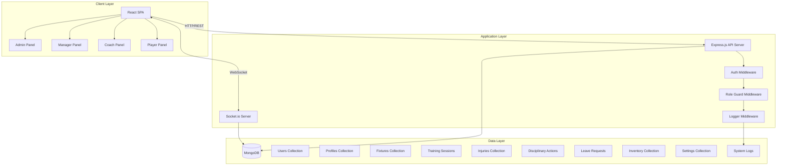
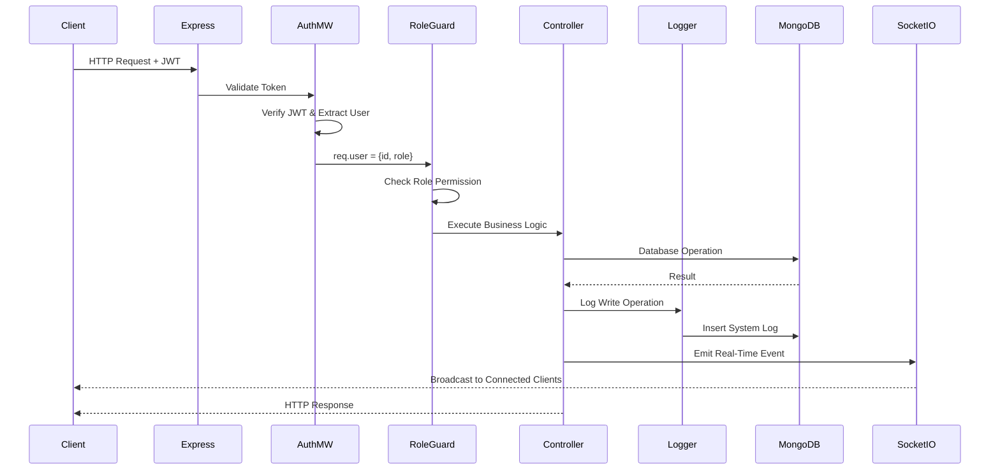
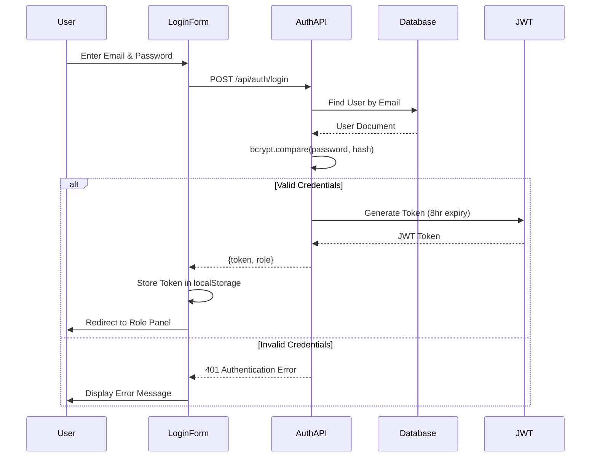
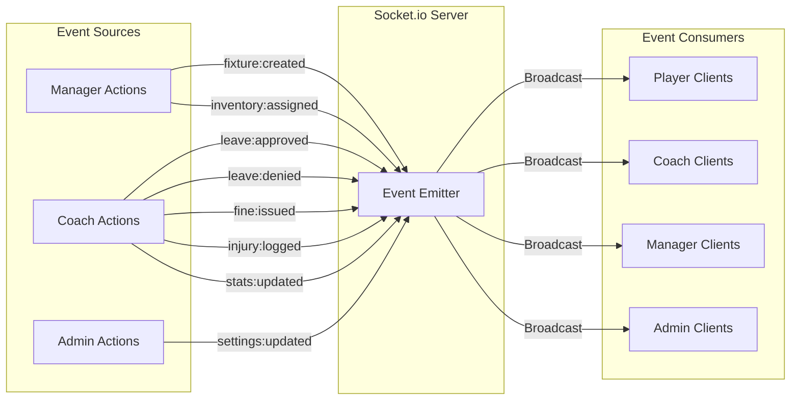
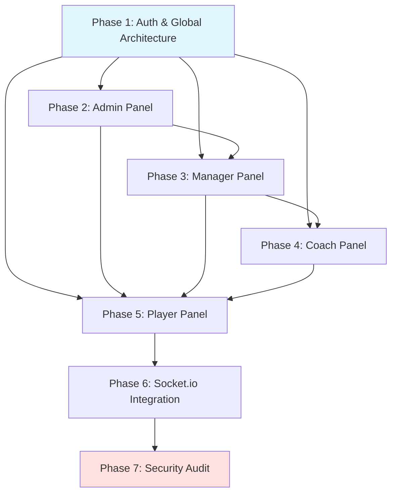
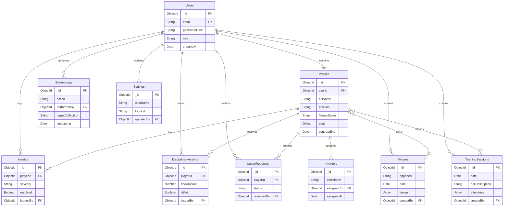

# Design Document: Football Club Management System

## Overview

The Football Club Management System is a full-stack web application built with a React frontend and Node.js/Express backend, using MongoDB for data persistence and Socket.io for real-time communication. The system implements role-based access control (RBAC) with four distinct user roles (Admin, Manager, Coach, Player), each with dedicated panels and specific permissions.

### System Architecture

The application follows a three-tier architecture:

1. **Presentation Layer**: React 18 SPA with role-specific panels, built with Vite
2. **Application Layer**: Express.js REST API with JWT authentication and Socket.io server
3. **Data Layer**: MongoDB with Mongoose ODM, 10 collections with enforced schemas

### Key Design Principles

- **Security First**: JWT authentication, role-based middleware, input sanitization
- **Real-Time Updates**: Socket.io events for cross-panel synchronization
- **Audit Trail**: Comprehensive logging of all database write operations
- **Phase Dependencies**: Strict implementation order to ensure foundation components exist before dependent features
- **Separation of Concerns**: Clear boundaries between authentication, business logic, and data access

### Technology Stack

**Frontend:**
- React 18 with React Router v6 for SPA routing
- Tailwind CSS for styling
- Vite for build tooling
- Socket.io-client for real-time updates
- React Context API for state management

**Backend:**
- Node.js with Express.js framework
- JWT (jsonwebtoken) for authentication
- bcrypt for password hashing
- Mongoose ODM for MongoDB interaction
- Socket.io for WebSocket server
- Multer for file upload handling

**Database:**
- MongoDB for document storage
- 10 collections with Mongoose schema validation

**Development Tools:**
- ESLint for code quality
- Environment variables (.env) for configuration

## Architecture

### High-Level System Diagram



### Request Flow Architecture



### Authentication Flow



### Real-Time Event Flow



### Phase Implementation Dependencies



## Components and Interfaces

### Backend Components

#### 1. Middleware Components

**authMiddleware.js**
```javascript
// Validates JWT tokens and attaches user to request
function authMiddleware(req, res, next) {
  // Extract Bearer token from Authorization header
  // Verify JWT using secret from environment
  // Decode payload to get {id, role}
  // Attach req.user = {id, role}
  // Call next() or return 401 if invalid
}
```

**roleGuard.js**
```javascript
// Factory function for role-based route protection
function requireRole(allowedRoles) {
  return (req, res, next) => {
    // Check if req.user.role is in allowedRoles array
    // Call next() if authorized
    // Return 403 if unauthorized
  }
}
```

**loggerMiddleware.js**
```javascript
// Logs all database write operations
function loggerMiddleware(req, res, next) {
  // Intercept POST, PUT, PATCH, DELETE requests
  // After controller execution, create SystemLog entry
  // Log: action, performedBy, targetCollection, targetId, timestamp
}
```

#### 2. Controller Components

**authController.js**
- `login(email, password)`: Validates credentials, generates JWT
- `logout()`: Clears client-side token
- `verifyToken(token)`: Validates JWT and returns user data

**userController.js** (Admin only)
- `createUser(email, password, role)`: Creates user and profile
- `getAllUsers()`: Returns paginated user list
- `updateUser(id, updates)`: Updates user data
- `deleteUser(id)`: Removes user and associated profile

**profileController.js**
- `getProfile(userId)`: Returns profile data
- `updateProfile(userId, updates)`: Updates profile fields
- `updateFitnessStatus(userId, status, notes)`: Updates health status
- `updateStats(userId, stats)`: Updates performance metrics

**fixtureController.js**
- `createFixture(data)`: Creates match, emits fixture:created
- `getAllFixtures()`: Returns fixtures with pagination
- `updateFixture(id, updates)`: Updates fixture, emits update event
- `assignLineup(fixtureId, lineup)`: Assigns players to fixture

**trainingController.js**
- `createSession(data)`: Creates training session
- `markAttendance(sessionId, playerId, status)`: Records attendance
- `getAllSessions()`: Returns sessions with pagination

**injuryController.js**
- `logInjury(data)`: Creates injury record, sets fitness to Red, emits injury:logged
- `getAllInjuries()`: Returns injury records with player data
- `markRecovered(injuryId)`: Updates injury status, resets fitness
- `getActiveInjuries()`: Returns unresolved injuries

**disciplinaryController.js**
- `logAction(data)`: Creates disciplinary action, emits fine:issued
- `getAllActions()`: Returns disciplinary records
- `markPaid(actionId, paymentDate)`: Updates payment status
- `getPendingFines()`: Returns unpaid fines with totals

**leaveController.js**
- `submitRequest(playerId, data)`: Creates leave request (status: Pending)
- `approveRequest(requestId, coachId)`: Updates status, emits leave:approved
- `denyRequest(requestId, coachId)`: Updates status, emits leave:denied
- `getPlayerRequests(playerId)`: Returns player's leave history
- `getPendingRequests()`: Returns all pending requests for coach

**inventoryController.js**
- `createItem(data)`: Creates inventory item
- `assignItem(itemId, playerId)`: Assigns to player, emits inventory:assigned
- `unassignItem(itemId, returnDate)`: Records return
- `getAllItems()`: Returns inventory with assignment status

**settingsController.js** (Admin only)
- `getSettings()`: Returns current club settings
- `updateSettings(data)`: Updates settings, emits settings:updated
- `uploadLogo(file)`: Handles logo upload, validates size/type

**documentController.js** (Manager only)
- `uploadDocument(playerId, file)`: Stores document, validates type/size
- `getPlayerDocuments(playerId)`: Returns document list
- `downloadDocument(documentId)`: Streams file for download
- `deleteDocument(documentId)`: Removes file and database record

**systemLogController.js** (Admin only)
- `getAllLogs(page, limit)`: Returns paginated logs in reverse chronological order
- Logs are read-only, no update/delete operations

#### 3. Socket.io Event Handlers

**socketServer.js**
```javascript
io.on('connection', (socket) => {
  // Authenticate socket connection using JWT
  // Store user role for targeted broadcasting
  
  // Event emitters (called from controllers):
  // - io.emit('fixture:created', fixtureData)
  // - io.emit('leave:approved', {requestId, playerId})
  // - io.emit('leave:denied', {requestId, playerId})
  // - io.emit('fine:issued', {actionId, playerId, amount})
  // - io.emit('injury:logged', {injuryId, playerId, status})
  // - io.emit('stats:updated', {playerId, stats})
  // - io.emit('inventory:assigned', {itemId, playerId})
  // - io.emit('settings:updated', settingsData)
})
```

### Frontend Components

#### Component Hierarchy

```
App
├── AuthProvider (Context)
├── SocketProvider (Context)
├── Router
│   ├── LoginPage
│   ├── AdminPanel
│   │   ├── UserManagement
│   │   │   ├── UserList
│   │   │   ├── CreateUserForm
│   │   │   └── EditUserModal
│   │   ├── ClubSettings
│   │   │   ├── SettingsForm
│   │   │   └── LogoUploader
│   │   └── SystemLogs
│   │       └── LogTable
│   ├── ManagerPanel
│   │   ├── FixtureCalendar
│   │   │   ├── CalendarView
│   │   │   └── CreateFixtureModal
│   │   ├── ContractManagement
│   │   │   ├── ContractList
│   │   │   └── ContractCountdown
│   │   ├── DocumentVault
│   │   │   ├── DocumentList
│   │   │   └── UploadModal
│   │   ├── InventoryManagement
│   │   │   ├── InventoryTable
│   │   │   └── AssignmentModal
│   │   └── FinanceDashboard
│   │       └── PendingFinesTable
│   ├── CoachPanel
│   │   ├── TacticalBoard
│   │   │   ├── FormationSelector
│   │   │   ├── PlayerDragDrop
│   │   │   └── LineupSaver
│   │   ├── TrainingSchedule
│   │   │   ├── SessionCalendar
│   │   │   ├── CreateSessionForm
│   │   │   └── AttendanceTracker
│   │   ├── SquadHealth
│   │   │   ├── FitnessStatusGrid
│   │   │   ├── InjuryLogger
│   │   │   └── ActiveInjuriesList
│   │   ├── DisciplinaryPanel
│   │   │   ├── LogFineForm
│   │   │   └── ActionHistory
│   │   ├── LeaveApproval
│   │   │   └── PendingRequestsList
│   │   └── PerformanceTracking
│   │       ├── PlayerStatsForm
│   │       └── PrivateNotesEditor
│   └── PlayerPanel
│       ├── PlayerDashboard
│       │   ├── ProfileCard
│       │   ├── FitnessIndicator
│       │   └── StatsDisplay
│       ├── PlayerCalendar
│       │   ├── FixturesList
│       │   └── TrainingList
│       ├── LeaveRequestForm
│       ├── EquipmentList
│       └── NotificationCenter
└── Shared Components
    ├── Navbar (with club logo)
    ├── ProtectedRoute
    ├── LoadingSpinner
    ├── ErrorBoundary
    └── Toast Notifications
```

#### Key Frontend Components

**AuthProvider.jsx**
- Manages authentication state (token, user, role)
- Provides login/logout functions
- Handles token storage in localStorage
- Redirects based on role after login

**SocketProvider.jsx**
- Establishes Socket.io connection with JWT authentication
- Listens for all 8 real-time events
- Updates React state when events received
- Implements reconnection logic with exponential backoff

**ProtectedRoute.jsx**
- Wraps routes requiring authentication
- Checks for valid token
- Redirects to login if unauthenticated
- Optionally checks role permissions

**TacticalBoard Component**
- Drag-and-drop interface using HTML5 Drag API
- Displays formation templates (4-4-2, 4-3-3, 3-5-2)
- Filters out Red fitness status players
- Validates max 11 starters + 7 substitutes
- Saves lineup to fixture via API

**CalendarView Component**
- Displays fixtures and training sessions
- Color-coded by event type
- Shows leave requests as "Excused" markers
- Updates in real-time via Socket.io events

**NotificationCenter Component**
- Displays toast notifications for Socket.io events
- Shows fine:issued, injury:logged, leave:approved/denied
- Auto-dismisses after 5 seconds
- Persists notification history

### API Endpoints Specification

#### Authentication Routes

**POST /api/auth/login**
- Body: `{email: string, password: string}`
- Response: `{token: string, role: string, userId: string}`
- Status: 200 (success), 401 (invalid credentials)
- No authentication required

**POST /api/auth/logout**
- Response: `{message: "Logged out successfully"}`
- Status: 200
- Clears client-side token (client responsibility)

**GET /api/auth/verify**
- Headers: `Authorization: Bearer <token>`
- Response: `{valid: boolean, user: {id, role}}`
- Status: 200 (valid), 401 (invalid/expired)

#### User Management Routes (Admin only)

**POST /api/users**
- Headers: `Authorization: Bearer <token>`
- Body: `{email: string, password: string, role: enum}`
- Response: `{user: UserObject, profile: ProfileObject}`
- Status: 201 (created), 400 (validation error), 403 (forbidden)
- Middleware: authMiddleware, requireRole(['admin'])

**GET /api/users**
- Headers: `Authorization: Bearer <token>`
- Query: `?page=1&limit=50`
- Response: `{users: UserObject[], total: number, page: number}`
- Status: 200, 403
- Middleware: authMiddleware, requireRole(['admin'])

**PUT /api/users/:id**
- Headers: `Authorization: Bearer <token>`
- Body: `{email?: string, role?: enum}`
- Response: `{user: UserObject}`
- Status: 200, 400, 403, 404
- Middleware: authMiddleware, requireRole(['admin']), loggerMiddleware

**DELETE /api/users/:id**
- Headers: `Authorization: Bearer <token>`
- Response: `{message: "User deleted"}`
- Status: 200, 403, 404
- Middleware: authMiddleware, requireRole(['admin']), loggerMiddleware

#### Profile Routes

**GET /api/profiles/:userId**
- Headers: `Authorization: Bearer <token>`
- Response: `{profile: ProfileObject}`
- Status: 200, 403, 404
- Middleware: authMiddleware
- Access: Admin (all), Manager (all), Coach (all), Player (own only)

**PUT /api/profiles/:userId**
- Headers: `Authorization: Bearer <token>`
- Body: `{fullName?: string, photo?: string, position?: string, ...}`
- Response: `{profile: ProfileObject}`
- Status: 200, 400, 403, 404
- Middleware: authMiddleware, requireRole(['admin', 'manager']), loggerMiddleware

**PUT /api/profiles/:userId/fitness**
- Headers: `Authorization: Bearer <token>`
- Body: `{status: enum('Green'|'Yellow'|'Red'), notes?: string}`
- Response: `{profile: ProfileObject}`
- Status: 200, 400, 403, 404
- Middleware: authMiddleware, requireRole(['coach', 'admin']), loggerMiddleware

**PUT /api/profiles/:userId/stats**
- Headers: `Authorization: Bearer <token>`
- Body: `{goals?: number, assists?: number, appearances?: number, rating?: number}`
- Response: `{profile: ProfileObject}`
- Status: 200, 400, 403, 404
- Middleware: authMiddleware, requireRole(['coach', 'admin']), loggerMiddleware
- Emits: stats:updated event via Socket.io

#### Fixture Routes

**POST /api/fixtures**
- Headers: `Authorization: Bearer <token>`
- Body: `{opponent: string, date: Date, location: string, matchType: string}`
- Response: `{fixture: FixtureObject}`
- Status: 201, 400, 403
- Middleware: authMiddleware, requireRole(['manager', 'admin']), loggerMiddleware
- Emits: fixture:created event via Socket.io

**GET /api/fixtures**
- Headers: `Authorization: Bearer <token>`
- Query: `?page=1&limit=50&startDate=ISO&endDate=ISO`
- Response: `{fixtures: FixtureObject[], total: number}`
- Status: 200, 403
- Middleware: authMiddleware

**PUT /api/fixtures/:id**
- Headers: `Authorization: Bearer <token>`
- Body: `{opponent?: string, date?: Date, location?: string, lineup?: ObjectId[]}`
- Response: `{fixture: FixtureObject}`
- Status: 200, 400, 403, 404
- Middleware: authMiddleware, requireRole(['manager', 'coach', 'admin']), loggerMiddleware
- Note: Only coach can update lineup field

**DELETE /api/fixtures/:id**
- Headers: `Authorization: Bearer <token>`
- Response: `{message: "Fixture deleted"}`
- Status: 200, 403, 404
- Middleware: authMiddleware, requireRole(['manager', 'admin']), loggerMiddleware

#### Training Session Routes

**POST /api/training**
- Headers: `Authorization: Bearer <token>`
- Body: `{date: Date, drillDescription: string, duration: number}`
- Response: `{session: TrainingSessionObject}`
- Status: 201, 400, 403
- Middleware: authMiddleware, requireRole(['coach', 'admin']), loggerMiddleware

**GET /api/training**
- Headers: `Authorization: Bearer <token>`
- Query: `?page=1&limit=50&startDate=ISO&endDate=ISO`
- Response: `{sessions: TrainingSessionObject[], total: number}`
- Status: 200, 403
- Middleware: authMiddleware

**PUT /api/training/:id/attendance**
- Headers: `Authorization: Bearer <token>`
- Body: `{playerId: ObjectId, status: enum('Present'|'Absent'|'Excused')}`
- Response: `{session: TrainingSessionObject}`
- Status: 200, 400, 403, 404
- Middleware: authMiddleware, requireRole(['coach', 'admin']), loggerMiddleware

#### Injury Routes

**POST /api/injuries**
- Headers: `Authorization: Bearer <token>`
- Body: `{playerId: ObjectId, injuryType: string, severity: string, expectedRecovery: Date}`
- Response: `{injury: InjuryObject}`
- Status: 201, 400, 403
- Middleware: authMiddleware, requireRole(['coach', 'admin']), loggerMiddleware
- Side Effect: Sets player fitness status to Red
- Emits: injury:logged event via Socket.io

**GET /api/injuries**
- Headers: `Authorization: Bearer <token>`
- Query: `?page=1&limit=50&resolved=false`
- Response: `{injuries: InjuryObject[], total: number}`
- Status: 200, 403
- Middleware: authMiddleware, requireRole(['coach', 'manager', 'admin'])

**PUT /api/injuries/:id/recover**
- Headers: `Authorization: Bearer <token>`
- Body: `{recoveryDate: Date, notes?: string}`
- Response: `{injury: InjuryObject}`
- Status: 200, 400, 403, 404
- Middleware: authMiddleware, requireRole(['coach', 'admin']), loggerMiddleware
- Side Effect: Updates player fitness status

#### Disciplinary Action Routes

**POST /api/disciplinary**
- Headers: `Authorization: Bearer <token>`
- Body: `{playerId: ObjectId, offense: string, fineAmount: number, dateIssued: Date}`
- Response: `{action: DisciplinaryActionObject}`
- Status: 201, 400, 403
- Middleware: authMiddleware, requireRole(['coach', 'admin']), loggerMiddleware
- Emits: fine:issued event via Socket.io

**GET /api/disciplinary**
- Headers: `Authorization: Bearer <token>`
- Query: `?page=1&limit=50&isPaid=false`
- Response: `{actions: DisciplinaryActionObject[], total: number}`
- Status: 200, 403
- Middleware: authMiddleware, requireRole(['coach', 'manager', 'admin'])

**PUT /api/disciplinary/:id/pay**
- Headers: `Authorization: Bearer <token>`
- Body: `{paymentDate: Date}`
- Response: `{action: DisciplinaryActionObject}`
- Status: 200, 400, 403, 404
- Middleware: authMiddleware, requireRole(['manager', 'admin']), loggerMiddleware

#### Leave Request Routes

**POST /api/leave**
- Headers: `Authorization: Bearer <token>`
- Body: `{startDate: Date, endDate: Date, reason: string}`
- Response: `{request: LeaveRequestObject}`
- Status: 201, 400, 403
- Middleware: authMiddleware, requireRole(['player'])
- Note: Automatically sets status to 'Pending', playerId from req.user.id

**GET /api/leave**
- Headers: `Authorization: Bearer <token>`
- Query: `?page=1&limit=50&status=Pending`
- Response: `{requests: LeaveRequestObject[], total: number}`
- Status: 200, 403
- Middleware: authMiddleware
- Access: Coach/Admin (all requests), Player (own requests only)

**PUT /api/leave/:id/approve**
- Headers: `Authorization: Bearer <token>`
- Response: `{request: LeaveRequestObject}`
- Status: 200, 403, 404
- Middleware: authMiddleware, requireRole(['coach', 'admin']), loggerMiddleware
- Emits: leave:approved event via Socket.io

**PUT /api/leave/:id/deny**
- Headers: `Authorization: Bearer <token>`
- Response: `{request: LeaveRequestObject}`
- Status: 200, 403, 404
- Middleware: authMiddleware, requireRole(['coach', 'admin']), loggerMiddleware
- Emits: leave:denied event via Socket.io

#### Inventory Routes

**POST /api/inventory**
- Headers: `Authorization: Bearer <token>`
- Body: `{itemName: string, itemType: string}`
- Response: `{item: InventoryObject}`
- Status: 201, 400, 403
- Middleware: authMiddleware, requireRole(['manager', 'admin']), loggerMiddleware

**GET /api/inventory**
- Headers: `Authorization: Bearer <token>`
- Query: `?page=1&limit=50&assigned=true`
- Response: `{items: InventoryObject[], total: number}`
- Status: 200, 403
- Middleware: authMiddleware

**PUT /api/inventory/:id/assign**
- Headers: `Authorization: Bearer <token>`
- Body: `{playerId: ObjectId, assignedAt: Date}`
- Response: `{item: InventoryObject}`
- Status: 200, 400, 403, 404
- Middleware: authMiddleware, requireRole(['manager', 'admin']), loggerMiddleware
- Emits: inventory:assigned event via Socket.io

**PUT /api/inventory/:id/return**
- Headers: `Authorization: Bearer <token>`
- Body: `{returnedAt: Date}`
- Response: `{item: InventoryObject}`
- Status: 200, 400, 403, 404
- Middleware: authMiddleware, requireRole(['manager', 'admin']), loggerMiddleware

#### Settings Routes (Admin only)

**GET /api/settings**
- Headers: `Authorization: Bearer <token>`
- Response: `{settings: SettingsObject}`
- Status: 200, 403
- Middleware: authMiddleware

**PUT /api/settings**
- Headers: `Authorization: Bearer <token>`
- Body: `{clubName?: string, logoUrl?: string}`
- Response: `{settings: SettingsObject}`
- Status: 200, 400, 403
- Middleware: authMiddleware, requireRole(['admin']), loggerMiddleware
- Emits: settings:updated event via Socket.io

**POST /api/settings/logo**
- Headers: `Authorization: Bearer <token>`, `Content-Type: multipart/form-data`
- Body: FormData with 'logo' field
- Response: `{logoUrl: string}`
- Status: 200, 400, 403
- Middleware: authMiddleware, requireRole(['admin']), multer upload
- Validation: Max 5MB, types: image/jpeg, image/png

#### Document Routes (Manager only)

**POST /api/documents**
- Headers: `Authorization: Bearer <token>`, `Content-Type: multipart/form-data`
- Body: FormData with 'document' field and 'playerId' field
- Response: `{document: DocumentObject}`
- Status: 201, 400, 403
- Middleware: authMiddleware, requireRole(['manager', 'admin']), multer upload
- Validation: Max 10MB, types: application/pdf, image/jpeg, image/png

**GET /api/documents/:playerId**
- Headers: `Authorization: Bearer <token>`
- Response: `{documents: DocumentObject[]}`
- Status: 200, 403, 404
- Middleware: authMiddleware, requireRole(['manager', 'admin'])

**GET /api/documents/download/:documentId**
- Headers: `Authorization: Bearer <token>`
- Response: File stream
- Status: 200, 403, 404
- Middleware: authMiddleware, requireRole(['manager', 'admin'])

**DELETE /api/documents/:documentId**
- Headers: `Authorization: Bearer <token>`
- Response: `{message: "Document deleted"}`
- Status: 200, 403, 404
- Middleware: authMiddleware, requireRole(['manager', 'admin']), loggerMiddleware

#### System Logs Routes (Admin only)

**GET /api/logs**
- Headers: `Authorization: Bearer <token>`
- Query: `?page=1&limit=50&startDate=ISO&endDate=ISO`
- Response: `{logs: SystemLogObject[], total: number}`
- Status: 200, 403
- Middleware: authMiddleware, requireRole(['admin'])
- Note: Read-only, sorted by timestamp descending

## Data Models

### MongoDB Collections and Mongoose Schemas

#### 1. Users Collection

```javascript
const UserSchema = new mongoose.Schema({
  email: {
    type: String,
    required: true,
    unique: true,
    lowercase: true,
    validate: {
      validator: (v) => /^[^\s@]+@[^\s@]+\.[^\s@]+$/.test(v),
      message: 'Invalid email format'
    }
  },
  passwordHash: {
    type: String,
    required: true
  },
  role: {
    type: String,
    required: true,
    enum: ['admin', 'manager', 'coach', 'player']
  },
  createdAt: {
    type: Date,
    default: Date.now
  }
});

// Indexes
UserSchema.index({ email: 1 });
UserSchema.index({ role: 1 });
```

**Relationships:**
- One-to-One with Profiles (userId reference)
- One-to-Many with SystemLogs (performedBy reference)

#### 2. Profiles Collection

```javascript
const ProfileSchema = new mongoose.Schema({
  userId: {
    type: mongoose.Schema.Types.ObjectId,
    ref: 'User',
    required: true,
    unique: true
  },
  fullName: {
    type: String,
    required: true,
    minlength: 2,
    maxlength: 100
  },
  photo: {
    type: String,
    default: null
  },
  position: {
    type: String,
    enum: ['Goalkeeper', 'Defender', 'Midfielder', 'Forward', 'Staff'],
    default: 'Staff'
  },
  weight: {
    type: Number,
    min: 40,
    max: 150
  },
  height: {
    type: Number,
    min: 150,
    max: 220
  },
  contractType: {
    type: String,
    enum: ['Full-Time', 'Part-Time', 'Loan', 'Trial'],
    default: 'Full-Time'
  },
  contractStart: Date,
  contractEnd: Date,
  fitnessStatus: {
    type: String,
    enum: ['Green', 'Yellow', 'Red'],
    default: 'Green'
  },
  stats: {
    goals: { type: Number, default: 0 },
    assists: { type: Number, default: 0 },
    appearances: { type: Number, default: 0 },
    rating: { type: Number, min: 0, max: 10, default: 0 }
  },
  performanceNotes: [{
    note: String,
    createdBy: { type: mongoose.Schema.Types.ObjectId, ref: 'User' },
    createdAt: { type: Date, default: Date.now }
  }]
});

// Indexes
ProfileSchema.index({ userId: 1 });
ProfileSchema.index({ fitnessStatus: 1 });
ProfileSchema.index({ contractEnd: 1 });
```

**Relationships:**
- Many-to-One with Users (userId reference)
- Referenced by Fixtures (lineup array)
- Referenced by Injuries, DisciplinaryActions, LeaveRequests, Inventory

#### 3. Fixtures Collection

```javascript
const FixtureSchema = new mongoose.Schema({
  opponent: {
    type: String,
    required: true,
    minlength: 2,
    maxlength: 100
  },
  date: {
    type: Date,
    required: true,
    validate: {
      validator: (v) => v >= new Date(),
      message: 'Fixture date cannot be in the past'
    }
  },
  location: {
    type: String,
    required: true
  },
  matchType: {
    type: String,
    enum: ['League', 'Cup', 'Friendly', 'Tournament'],
    default: 'League'
  },
  lineup: [{
    type: mongoose.Schema.Types.ObjectId,
    ref: 'Profile'
  }],
  createdBy: {
    type: mongoose.Schema.Types.ObjectId,
    ref: 'User',
    required: true
  },
  createdAt: {
    type: Date,
    default: Date.now
  }
});

// Indexes
FixtureSchema.index({ date: 1 });
FixtureSchema.index({ createdBy: 1 });

// Validation
FixtureSchema.pre('save', function(next) {
  if (this.lineup && this.lineup.length > 18) {
    next(new Error('Lineup cannot exceed 18 players (11 starters + 7 subs)'));
  }
  next();
});
```

**Relationships:**
- Many-to-One with Users (createdBy reference)
- Many-to-Many with Profiles (lineup array)

#### 4. TrainingSessions Collection

```javascript
const TrainingSessionSchema = new mongoose.Schema({
  date: {
    type: Date,
    required: true,
    validate: {
      validator: (v) => v >= new Date(),
      message: 'Training date cannot be in the past'
    }
  },
  drillDescription: {
    type: String,
    required: true,
    minlength: 10,
    maxlength: 500
  },
  duration: {
    type: Number,
    required: true,
    min: 30,
    max: 300
  },
  attendees: [{
    playerId: { type: mongoose.Schema.Types.ObjectId, ref: 'Profile' },
    status: { 
      type: String, 
      enum: ['Present', 'Absent', 'Excused'],
      default: 'Absent'
    }
  }],
  createdBy: {
    type: mongoose.Schema.Types.ObjectId,
    ref: 'User',
    required: true
  },
  createdAt: {
    type: Date,
    default: Date.now
  }
});

// Indexes
TrainingSessionSchema.index({ date: 1 });
TrainingSessionSchema.index({ createdBy: 1 });
```

**Relationships:**
- Many-to-One with Users (createdBy reference)
- Many-to-Many with Profiles (attendees array)

#### 5. Injuries Collection

```javascript
const InjurySchema = new mongoose.Schema({
  playerId: {
    type: mongoose.Schema.Types.ObjectId,
    ref: 'Profile',
    required: true
  },
  injuryType: {
    type: String,
    required: true,
    minlength: 3,
    maxlength: 100
  },
  severity: {
    type: String,
    enum: ['Minor', 'Moderate', 'Severe'],
    required: true
  },
  description: {
    type: String,
    maxlength: 500
  },
  dateLogged: {
    type: Date,
    default: Date.now
  },
  expectedRecovery: {
    type: Date,
    required: true
  },
  actualRecovery: {
    type: Date,
    default: null
  },
  resolved: {
    type: Boolean,
    default: false
  },
  loggedBy: {
    type: mongoose.Schema.Types.ObjectId,
    ref: 'User',
    required: true
  }
});

// Indexes
InjurySchema.index({ playerId: 1 });
InjurySchema.index({ resolved: 1 });
InjurySchema.index({ dateLogged: -1 });
```

**Relationships:**
- Many-to-One with Profiles (playerId reference)
- Many-to-One with Users (loggedBy reference)

#### 6. DisciplinaryActions Collection

```javascript
const DisciplinaryActionSchema = new mongoose.Schema({
  playerId: {
    type: mongoose.Schema.Types.ObjectId,
    ref: 'Profile',
    required: true
  },
  offense: {
    type: String,
    required: true,
    minlength: 5,
    maxlength: 200
  },
  fineAmount: {
    type: Number,
    required: true,
    min: 0,
    max: 100000
  },
  dateIssued: {
    type: Date,
    default: Date.now
  },
  isPaid: {
    type: Boolean,
    default: false
  },
  paymentDate: {
    type: Date,
    default: null
  },
  issuedBy: {
    type: mongoose.Schema.Types.ObjectId,
    ref: 'User',
    required: true
  }
});

// Indexes
DisciplinaryActionSchema.index({ playerId: 1 });
DisciplinaryActionSchema.index({ isPaid: 1 });
DisciplinaryActionSchema.index({ dateIssued: -1 });
```

**Relationships:**
- Many-to-One with Profiles (playerId reference)
- Many-to-One with Users (issuedBy reference)

#### 7. LeaveRequests Collection

```javascript
const LeaveRequestSchema = new mongoose.Schema({
  playerId: {
    type: mongoose.Schema.Types.ObjectId,
    ref: 'Profile',
    required: true
  },
  startDate: {
    type: Date,
    required: true
  },
  endDate: {
    type: Date,
    required: true,
    validate: {
      validator: function(v) {
        return v >= this.startDate;
      },
      message: 'End date must be after start date'
    }
  },
  reason: {
    type: String,
    required: true,
    minlength: 10,
    maxlength: 500
  },
  status: {
    type: String,
    enum: ['Pending', 'Approved', 'Denied'],
    default: 'Pending'
  },
  dateRequested: {
    type: Date,
    default: Date.now
  },
  reviewedBy: {
    type: mongoose.Schema.Types.ObjectId,
    ref: 'User',
    default: null
  },
  reviewedAt: {
    type: Date,
    default: null
  }
});

// Indexes
LeaveRequestSchema.index({ playerId: 1 });
LeaveRequestSchema.index({ status: 1 });
LeaveRequestSchema.index({ startDate: 1 });
```

**Relationships:**
- Many-to-One with Profiles (playerId reference)
- Many-to-One with Users (reviewedBy reference)

#### 8. Inventory Collection

```javascript
const InventorySchema = new mongoose.Schema({
  itemName: {
    type: String,
    required: true,
    minlength: 2,
    maxlength: 100
  },
  itemType: {
    type: String,
    enum: ['Jersey', 'Boots', 'Training Equipment', 'Medical', 'Other'],
    required: true
  },
  assignedTo: {
    type: mongoose.Schema.Types.ObjectId,
    ref: 'Profile',
    default: null
  },
  assignedAt: {
    type: Date,
    default: null
  },
  returnedAt: {
    type: Date,
    default: null
  },
  createdAt: {
    type: Date,
    default: Date.now
  }
});

// Indexes
InventorySchema.index({ assignedTo: 1 });
InventorySchema.index({ itemType: 1 });

// Virtual for assignment status
InventorySchema.virtual('isAssigned').get(function() {
  return this.assignedTo !== null && this.returnedAt === null;
});
```

**Relationships:**
- Many-to-One with Profiles (assignedTo reference)

#### 9. Settings Collection

```javascript
const SettingsSchema = new mongoose.Schema({
  clubName: {
    type: String,
    required: true,
    minlength: 3,
    maxlength: 100
  },
  logoUrl: {
    type: String,
    default: null
  },
  updatedAt: {
    type: Date,
    default: Date.now
  },
  updatedBy: {
    type: mongoose.Schema.Types.ObjectId,
    ref: 'User'
  }
});

// Ensure only one settings document exists
SettingsSchema.statics.getSingleton = async function() {
  let settings = await this.findOne();
  if (!settings) {
    settings = await this.create({ clubName: 'Football Club' });
  }
  return settings;
};
```

**Relationships:**
- Many-to-One with Users (updatedBy reference)
- Singleton pattern (only one document)

#### 10. SystemLogs Collection

```javascript
const SystemLogSchema = new mongoose.Schema({
  action: {
    type: String,
    required: true,
    enum: ['CREATE', 'UPDATE', 'DELETE']
  },
  performedBy: {
    type: mongoose.Schema.Types.ObjectId,
    ref: 'User',
    required: true
  },
  targetCollection: {
    type: String,
    required: true
  },
  targetId: {
    type: mongoose.Schema.Types.ObjectId,
    required: true
  },
  changes: {
    type: mongoose.Schema.Types.Mixed,
    default: {}
  },
  timestamp: {
    type: Date,
    default: Date.now,
    immutable: true
  }
});

// Indexes
SystemLogSchema.index({ timestamp: -1 });
SystemLogSchema.index({ performedBy: 1 });
SystemLogSchema.index({ targetCollection: 1 });

// Prevent updates and deletes
SystemLogSchema.pre('updateOne', function() {
  throw new Error('System logs cannot be modified');
});

SystemLogSchema.pre('deleteOne', function() {
  throw new Error('System logs cannot be deleted');
});
```

**Relationships:**
- Many-to-One with Users (performedBy reference)
- References all collections via targetCollection and targetId

### Database Relationships Diagram



### Security Architecture

#### Authentication Implementation

**JWT Token Structure:**
```javascript
{
  header: {
    alg: "HS256",
    typ: "JWT"
  },
  payload: {
    id: "user_objectId",
    role: "admin|manager|coach|player",
    iat: 1234567890,
    exp: 1234596690  // 8 hours from iat
  },
  signature: "HMACSHA256(base64UrlEncode(header) + '.' + base64UrlEncode(payload), secret)"
}
```

**Password Hashing:**
```javascript
// On user creation/password update
const bcrypt = require('bcrypt');
const saltRounds = 10;
const passwordHash = await bcrypt.hash(plainPassword, saltRounds);

// On login
const isValid = await bcrypt.compare(plainPassword, storedHash);
```

**Token Storage:**
- Client: localStorage with key 'authToken'
- Sent in Authorization header: `Bearer <token>`
- Cleared on logout or 401 response

#### Authorization Matrix

| Route Pattern | Admin | Manager | Coach | Player |
|--------------|-------|---------|-------|--------|
| /api/auth/* | ✓ | ✓ | ✓ | ✓ |
| /api/users/* | ✓ | ✗ | ✗ | ✗ |
| /api/settings/* | ✓ | ✗ | ✗ | ✗ |
| /api/logs/* | ✓ | ✗ | ✗ | ✗ |
| /api/profiles/* (read) | ✓ | ✓ | ✓ | Own only |
| /api/profiles/* (write) | ✓ | ✓ | ✗ | ✗ |
| /api/profiles/*/fitness | ✓ | ✗ | ✓ | ✗ |
| /api/profiles/*/stats | ✓ | ✗ | ✓ | ✗ |
| /api/fixtures/* (read) | ✓ | ✓ | ✓ | ✓ |
| /api/fixtures/* (create) | ✓ | ✓ | ✗ | ✗ |
| /api/fixtures/*/lineup | ✓ | ✗ | ✓ | ✗ |
| /api/training/* (read) | ✓ | ✓ | ✓ | ✓ |
| /api/training/* (write) | ✓ | ✗ | ✓ | ✗ |
| /api/injuries/* | ✓ | Read | ✓ | Read own |
| /api/disciplinary/* | ✓ | Read | ✓ | Read own |
| /api/disciplinary/*/pay | ✓ | ✓ | ✗ | ✗ |
| /api/leave/* (submit) | ✓ | ✗ | ✗ | ✓ |
| /api/leave/* (approve) | ✓ | ✗ | ✓ | ✗ |
| /api/inventory/* | ✓ | ✓ | Read | Read own |
| /api/documents/* | ✓ | ✓ | ✗ | ✗ |

#### Input Validation and Sanitization

**Validation Strategy:**
1. **Schema-level validation**: Mongoose schema validators (required, min, max, enum)
2. **Custom validators**: Email format, date ranges, file types
3. **Sanitization**: Strip HTML tags, trim whitespace, escape special characters

**Implementation:**
```javascript
const validator = require('validator');
const sanitizeHtml = require('sanitize-html');

// Email validation
if (!validator.isEmail(email)) {
  throw new ValidationError('Invalid email format');
}

// Sanitize text inputs
const sanitizedInput = sanitizeHtml(userInput, {
  allowedTags: [],
  allowedAttributes: {}
});

// Date range validation
if (new Date(endDate) < new Date(startDate)) {
  throw new ValidationError('End date must be after start date');
}
```

#### Rate Limiting

**Configuration:**
```javascript
const rateLimit = require('express-rate-limit');

const limiter = rateLimit({
  windowMs: 15 * 60 * 1000, // 15 minutes
  max: 100, // 100 requests per window
  message: 'Too many requests from this IP, please try again later',
  standardHeaders: true,
  legacyHeaders: false
});

app.use('/api/', limiter);
```

#### HTTPS and CORS

**Production Configuration:**
```javascript
// Force HTTPS in production
if (process.env.NODE_ENV === 'production') {
  app.use((req, res, next) => {
    if (req.header('x-forwarded-proto') !== 'https') {
      res.redirect(`https://${req.header('host')}${req.url}`);
    } else {
      next();
    }
  });
}

// CORS configuration
const cors = require('cors');
app.use(cors({
  origin: process.env.CLIENT_URL,
  credentials: true
}));
```

### File Upload Handling

#### Multer Configuration

**Logo Upload (Admin):**
```javascript
const multer = require('multer');
const path = require('path');

const logoStorage = multer.diskStorage({
  destination: './uploads/logos/',
  filename: (req, file, cb) => {
    const uniqueName = `logo-${Date.now()}${path.extname(file.originalname)}`;
    cb(null, uniqueName);
  }
});

const logoUpload = multer({
  storage: logoStorage,
  limits: { fileSize: 5 * 1024 * 1024 }, // 5MB
  fileFilter: (req, file, cb) => {
    const allowedTypes = ['image/jpeg', 'image/png'];
    if (allowedTypes.includes(file.mimetype)) {
      cb(null, true);
    } else {
      cb(new Error('Invalid file type. Only JPEG and PNG allowed.'));
    }
  }
});
```

**Document Upload (Manager):**
```javascript
const documentStorage = multer.diskStorage({
  destination: './uploads/documents/',
  filename: (req, file, cb) => {
    const uniqueName = `doc-${Date.now()}-${file.originalname}`;
    cb(null, uniqueName);
  }
});

const documentUpload = multer({
  storage: documentStorage,
  limits: { fileSize: 10 * 1024 * 1024 }, // 10MB
  fileFilter: (req, file, cb) => {
    const allowedTypes = ['application/pdf', 'image/jpeg', 'image/png'];
    if (allowedTypes.includes(file.mimetype)) {
      cb(null, true);
    } else {
      cb(new Error('Invalid file type. Only PDF, JPEG, and PNG allowed.'));
    }
  }
});
```

#### Image Optimization

**Logo Processing:**
```javascript
const sharp = require('sharp');

async function optimizeLogo(filePath) {
  const outputPath = filePath.replace(/\.[^.]+$/, '-optimized.png');
  
  await sharp(filePath)
    .resize(1920, null, { // Max width 1920px, maintain aspect ratio
      withoutEnlargement: true,
      fit: 'inside'
    })
    .png({ quality: 90 })
    .toFile(outputPath);
  
  return outputPath;
}
```

#### File Cleanup

**Error Handling:**
```javascript
// Cleanup on upload failure
app.use((err, req, res, next) => {
  if (err instanceof multer.MulterError) {
    // Remove uploaded file if validation fails
    if (req.file) {
      fs.unlinkSync(req.file.path);
    }
    return res.status(400).json({ error: err.message });
  }
  next(err);
});
```

### State Management Patterns

#### React Context Architecture

**AuthContext:**
```javascript
const AuthContext = createContext();

export function AuthProvider({ children }) {
  const [user, setUser] = useState(null);
  const [token, setToken] = useState(localStorage.getItem('authToken'));
  const [loading, setLoading] = useState(true);

  useEffect(() => {
    if (token) {
      verifyToken(token).then(userData => {
        setUser(userData);
        setLoading(false);
      }).catch(() => {
        logout();
      });
    } else {
      setLoading(false);
    }
  }, [token]);

  const login = async (email, password) => {
    const response = await fetch('/api/auth/login', {
      method: 'POST',
      headers: { 'Content-Type': 'application/json' },
      body: JSON.stringify({ email, password })
    });
    const data = await response.json();
    localStorage.setItem('authToken', data.token);
    setToken(data.token);
    setUser({ id: data.userId, role: data.role });
    return data.role; // For redirect logic
  };

  const logout = () => {
    localStorage.removeItem('authToken');
    setToken(null);
    setUser(null);
  };

  return (
    <AuthContext.Provider value={{ user, token, login, logout, loading }}>
      {children}
    </AuthContext.Provider>
  );
}
```

**SocketContext:**
```javascript
const SocketContext = createContext();

export function SocketProvider({ children }) {
  const { token } = useAuth();
  const [socket, setSocket] = useState(null);
  const [connected, setConnected] = useState(false);
  const [events, setEvents] = useState([]);

  useEffect(() => {
    if (!token) return;

    const newSocket = io(process.env.REACT_APP_API_URL, {
      auth: { token }
    });

    newSocket.on('connect', () => {
      setConnected(true);
      console.log('Socket connected');
    });

    newSocket.on('disconnect', () => {
      setConnected(false);
      console.log('Socket disconnected');
    });

    // Listen for all event types
    const eventTypes = [
      'fixture:created', 'leave:approved', 'leave:denied',
      'fine:issued', 'injury:logged', 'stats:updated',
      'inventory:assigned', 'settings:updated'
    ];

    eventTypes.forEach(eventType => {
      newSocket.on(eventType, (data) => {
        setEvents(prev => [...prev, { type: eventType, data, timestamp: Date.now() }]);
      });
    });

    setSocket(newSocket);

    return () => newSocket.close();
  }, [token]);

  return (
    <SocketContext.Provider value={{ socket, connected, events }}>
      {children}
    </SocketContext.Provider>
  );
}
```

#### Component State Patterns

**Data Fetching Pattern:**
```javascript
function useFixtures() {
  const [fixtures, setFixtures] = useState([]);
  const [loading, setLoading] = useState(true);
  const [error, setError] = useState(null);
  const { token } = useAuth();
  const { events } = useSocket();

  useEffect(() => {
    fetchFixtures();
  }, []);

  // Update on real-time events
  useEffect(() => {
    const fixtureEvents = events.filter(e => e.type === 'fixture:created');
    if (fixtureEvents.length > 0) {
      fetchFixtures(); // Refetch to get latest data
    }
  }, [events]);

  const fetchFixtures = async () => {
    try {
      setLoading(true);
      const response = await fetch('/api/fixtures', {
        headers: { 'Authorization': `Bearer ${token}` }
      });
      const data = await response.json();
      setFixtures(data.fixtures);
    } catch (err) {
      setError(err.message);
    } finally {
      setLoading(false);
    }
  };

  return { fixtures, loading, error, refetch: fetchFixtures };
}
```

**Form State Pattern:**
```javascript
function CreateFixtureForm() {
  const [formData, setFormData] = useState({
    opponent: '',
    date: '',
    location: '',
    matchType: 'League'
  });
  const [submitting, setSubmitting] = useState(false);
  const [errors, setErrors] = useState({});
  const { token } = useAuth();

  const handleChange = (e) => {
    setFormData(prev => ({
      ...prev,
      [e.target.name]: e.target.value
    }));
    // Clear error for this field
    setErrors(prev => ({ ...prev, [e.target.name]: null }));
  };

  const handleSubmit = async (e) => {
    e.preventDefault();
    setSubmitting(true);
    
    try {
      const response = await fetch('/api/fixtures', {
        method: 'POST',
        headers: {
          'Authorization': `Bearer ${token}`,
          'Content-Type': 'application/json'
        },
        body: JSON.stringify(formData)
      });
      
      if (!response.ok) {
        const errorData = await response.json();
        setErrors(errorData.errors || {});
        return;
      }
      
      // Success - form will update via Socket.io event
      setFormData({ opponent: '', date: '', location: '', matchType: 'League' });
    } catch (err) {
      setErrors({ general: err.message });
    } finally {
      setSubmitting(false);
    }
  };

  return (
    <form onSubmit={handleSubmit}>
      {/* Form fields */}
    </form>
  );
}
```

### Real-Time Event Handling

#### Socket.io Server Implementation

**Server Setup:**
```javascript
const io = require('socket.io')(server, {
  cors: {
    origin: process.env.CLIENT_URL,
    credentials: true
  }
});

// Authentication middleware for Socket.io
io.use((socket, next) => {
  const token = socket.handshake.auth.token;
  
  if (!token) {
    return next(new Error('Authentication error'));
  }
  
  try {
    const decoded = jwt.verify(token, process.env.JWT_SECRET);
    socket.userId = decoded.id;
    socket.userRole = decoded.role;
    next();
  } catch (err) {
    next(new Error('Invalid token'));
  }
});

io.on('connection', (socket) => {
  console.log(`User connected: ${socket.userId} (${socket.userRole})`);
  
  socket.on('disconnect', () => {
    console.log(`User disconnected: ${socket.userId}`);
  });
});

// Export io instance for use in controllers
module.exports = io;
```

**Event Emission from Controllers:**
```javascript
// In fixtureController.js
const io = require('../socketServer');

async function createFixture(req, res) {
  try {
    const fixture = await Fixture.create({
      ...req.body,
      createdBy: req.user.id
    });
    
    // Emit real-time event
    io.emit('fixture:created', {
      fixtureId: fixture._id,
      opponent: fixture.opponent,
      date: fixture.date,
      location: fixture.location
    });
    
    res.status(201).json({ fixture });
  } catch (error) {
    res.status(400).json({ error: error.message });
  }
}
```

#### Client-Side Event Handling

**Event Listener Pattern:**
```javascript
function PlayerDashboard() {
  const { events } = useSocket();
  const { user } = useAuth();
  const [notifications, setNotifications] = useState([]);

  useEffect(() => {
    // Filter events relevant to this player
    const playerEvents = events.filter(event => {
      switch (event.type) {
        case 'fine:issued':
        case 'injury:logged':
        case 'stats:updated':
        case 'inventory:assigned':
          return event.data.playerId === user.id;
        case 'leave:approved':
        case 'leave:denied':
          return event.data.playerId === user.id;
        case 'fixture:created':
        case 'settings:updated':
          return true; // All players see these
        default:
          return false;
      }
    });

    // Create notifications
    playerEvents.forEach(event => {
      const notification = createNotification(event);
      setNotifications(prev => [notification, ...prev]);
      
      // Auto-dismiss after 5 seconds
      setTimeout(() => {
        setNotifications(prev => prev.filter(n => n.id !== notification.id));
      }, 5000);
    });
  }, [events, user.id]);

  return (
    <div>
      <NotificationCenter notifications={notifications} />
      {/* Dashboard content */}
    </div>
  );
}

function createNotification(event) {
  const messages = {
    'fine:issued': `You have been fined $${event.data.amount} for ${event.data.offense}`,
    'injury:logged': `Injury logged: ${event.data.injuryType}. Status set to Red.`,
    'stats:updated': `Your stats have been updated`,
    'inventory:assigned': `New equipment assigned: ${event.data.itemName}`,
    'leave:approved': `Your leave request has been approved`,
    'leave:denied': `Your leave request has been denied`,
    'fixture:created': `New fixture: ${event.data.opponent} on ${event.data.date}`,
    'settings:updated': `Club settings have been updated`
  };

  return {
    id: `${event.type}-${event.timestamp}`,
    message: messages[event.type] || 'New update',
    type: event.type,
    timestamp: event.timestamp
  };
}
```

#### Reconnection Strategy

**Exponential Backoff:**
```javascript
function SocketProvider({ children }) {
  const [reconnectAttempts, setReconnectAttempts] = useState(0);
  const maxAttempts = 5;

  useEffect(() => {
    if (!token) return;

    const newSocket = io(process.env.REACT_APP_API_URL, {
      auth: { token },
      reconnection: true,
      reconnectionDelay: 1000,
      reconnectionDelayMax: 5000,
      reconnectionAttempts: maxAttempts
    });

    newSocket.on('connect', () => {
      setReconnectAttempts(0);
      console.log('Socket connected');
    });

    newSocket.on('reconnect_attempt', (attempt) => {
      setReconnectAttempts(attempt);
      console.log(`Reconnection attempt ${attempt}/${maxAttempts}`);
    });

    newSocket.on('reconnect_failed', () => {
      console.error('Failed to reconnect after maximum attempts');
      // Show user notification to refresh page
    });

    setSocket(newSocket);

    return () => newSocket.close();
  }, [token]);

  return (
    <SocketContext.Provider value={{ socket, connected, events, reconnectAttempts }}>
      {children}
    </SocketContext.Provider>
  );
}
```

## Correctness Properties

*A property is a characteristic or behavior that should hold true across all valid executions of a system-essentially, a formal statement about what the system should do. Properties serve as the bridge between human-readable specifications and machine-verifiable correctness guarantees.*

### Property Reflection

After analyzing all 25 requirements with 140+ acceptance criteria, I identified the following redundancies and consolidations:

**Authorization Properties (2.2-2.9):** All specific role-based access control criteria (2.3-2.9) are subsumed by the general property 2.2 that validates role-based route access across all roles and routes. A single comprehensive property can validate the entire authorization matrix.

**Real-Time Event Broadcasting (18.1-18.7):** All individual event broadcasting criteria can be consolidated into a single property that validates event emission for all event types when corresponding database operations occur.

**Date Range Validation (7.4, 12.7, 20.3):** Multiple criteria validate that end dates must not precede start dates. These can be consolidated into a single property for all date range inputs.

**File Upload Validation (4.4, 8.1, 8.2, 20.5):** Multiple criteria validate file type and size limits. These can be consolidated into a single property that validates file uploads across all upload endpoints.

**Audit Logging (3.3, 3.4, 5.1, 6.5, etc.):** Multiple criteria require logging of database write operations. These can be consolidated into a single property that validates logging occurs for all write operations.

**Data Persistence (3.1, 6.1, 7.1, 9.1, etc.):** Multiple criteria validate that data is stored with all required fields. These can be consolidated into properties per collection type rather than per requirement.

After reflection, the following properties provide comprehensive coverage without redundancy:

### Property 1: JWT Token Generation and Expiry

*For any* valid user credentials, when authentication succeeds, the generated JWT token should have an expiry time exactly 8 hours from issuance, and tokens older than 8 hours should be rejected by the authentication middleware.

**Validates: Requirements 1.1, 1.3, 21.1**

### Property 2: Authentication Error Handling

*For any* invalid credentials (wrong password, non-existent email, malformed input), the authentication service should return an authentication error without revealing whether the email exists.

**Validates: Requirements 1.2**

### Property 3: Password Storage Security

*For any* user account, the stored password field should be a valid bcrypt hash with cost factor 10, and plaintext passwords should never be stored in the database.

**Validates: Requirements 1.4, 21.6**

### Property 4: Role-Based Route Authorization

*For any* API route and user role combination, the system should enforce the authorization matrix: Admin can access all routes, Manager can access manager and shared routes, Coach can access coach and shared routes, and Player can access only player routes.

**Validates: Requirements 2.2, 2.3, 2.4, 2.5, 2.6, 2.7, 2.8, 2.9, 6.6, 16.4, 17.4**

### Property 5: Protected Route Authentication

*For any* non-authentication API route, requests without a valid JWT token should be rejected with 401 status, and requests with valid tokens should proceed to authorization checks.

**Validates: Requirements 2.1**

### Property 6: User Creation with Profile

*For any* user creation request with valid email, password, and role, the system should create both a User document and an associated Profile document, with referential integrity maintained between them.

**Validates: Requirements 3.1, 3.6, 22.2**

### Property 7: Role Enumeration Validation

*For any* user creation or update request, the role field should only accept values from the enum ['admin', 'manager', 'coach', 'player'], and any other value should be rejected with a validation error.

**Validates: Requirements 3.2**

### Property 8: Email Uniqueness Constraint

*For any* user creation request, if a user with the same email already exists, the system should reject the request with a duplicate email error.

**Validates: Requirements 3.5**

### Property 9: Audit Logging for Write Operations

*For any* database write operation (CREATE, UPDATE, DELETE) on any collection, the system should create a SystemLog entry with action, performedBy, targetCollection, targetId, and timestamp fields populated.

**Validates: Requirements 3.3, 3.4, 5.1, 5.4, 6.5, 10.5, 11.3, 13.3, 14.6**

### Property 10: System Log Immutability

*For any* SystemLog document, attempts to update or delete it should fail with an error, ensuring audit trail integrity.

**Validates: Requirements 5.3**

### Property 11: System Log Chronological Ordering

*For any* request to retrieve system logs, the returned logs should be sorted by timestamp in descending order (newest first).

**Validates: Requirements 5.5**

### Property 12: Settings Update Broadcasting

*For any* club settings update, the system should both persist the changes to the database and emit a settings:updated event via Socket.io to all connected clients.

**Validates: Requirements 4.1, 4.2, 4.3**

### Property 13: Club Name Length Validation

*For any* club settings update, the club name should be validated to be between 3 and 100 characters inclusive, and values outside this range should be rejected.

**Validates: Requirements 4.5**

### Property 14: Date Range Validation

*For any* input containing start and end dates (contracts, leave requests, fixtures, training sessions), the end date should not be earlier than the start date, and invalid ranges should be rejected with a validation error.

**Validates: Requirements 7.4, 12.7, 20.3**

### Property 15: Future Date Validation

*For any* fixture or training session creation, the date field should not be in the past, and past dates should be rejected with a validation error.

**Validates: Requirements 6.4, 11.5**

### Property 16: File Upload Validation

*For any* file upload (logo, document), the system should validate file type against allowed types and file size against the specified limit (5MB for logos, 10MB for documents), rejecting invalid uploads before storage.

**Validates: Requirements 4.4, 8.1, 8.2, 20.5**

### Property 17: Document Deletion with Cleanup

*For any* document deletion request, the system should remove both the file from storage and the database record, and create an audit log entry.

**Validates: Requirements 8.5**

### Property 18: Real-Time Event Broadcasting

*For any* database write operation that triggers a real-time event (fixture creation, leave approval/denial, fine issuance, injury logging, stats update, inventory assignment, settings update), the Socket.io server should broadcast the corresponding event to all connected clients.

**Validates: Requirements 6.2, 9.2, 12.3, 12.4, 14.3, 15.2, 16.2, 18.1, 18.2, 18.3, 18.4, 18.5, 18.6, 18.7**

### Property 19: Lineup Size Constraint

*For any* fixture lineup assignment, the total number of players should not exceed 18 (11 starters + 7 substitutes), and lineups exceeding this limit should be rejected.

**Validates: Requirements 10.6**

### Property 20: Injured Player Exclusion from Lineup

*For any* lineup assignment, players with Red fitness status should be excluded from selection, and attempts to assign injured players should be rejected.

**Validates: Requirements 10.2, 10.3**

### Property 21: Leave Request Status Initialization

*For any* leave request submission by a player, the initial status should be set to 'Pending' automatically, regardless of the request content.

**Validates: Requirements 12.2**

### Property 22: Fitness Status Enumeration

*For any* fitness status update, the value should only accept 'Green', 'Yellow', or 'Red', and any other value should be rejected with a validation error.

**Validates: Requirements 13.1**

### Property 23: Injury Logging Side Effect

*For any* injury record creation, the system should automatically set the associated player's fitness status to 'Red' as a side effect of the injury logging operation.

**Validates: Requirements 14.2**

### Property 24: Player Rating Range Validation

*For any* player statistics update, the rating field should be validated to be between 0 and 10 inclusive, and values outside this range should be rejected.

**Validates: Requirements 16.5**

### Property 25: Configuration Round-Trip Property

*For any* valid configuration object, serializing it to a configuration file format and then parsing it back should produce an equivalent configuration object with all fields preserved.

**Validates: Requirements 19.4**

### Property 26: Required Field Validation

*For any* configuration file parsing, the parser should validate that all required fields (database connection string, JWT secret, port number, Socket.io configuration) are present, and reject configurations missing any required field.

**Validates: Requirements 19.5**

### Property 27: Email Format Validation

*For any* email input across all endpoints, the system should validate the email format according to RFC 5322 standard, rejecting malformed email addresses.

**Validates: Requirements 20.2**

### Property 28: Numeric Range Validation

*For any* numeric input field (fine amount, rating, weight, height, duration), the system should validate that the value is within the acceptable range defined in the schema, rejecting out-of-range values.

**Validates: Requirements 20.4**

### Property 29: Validation Error Messages

*For any* validation failure, the system should return an error response that includes the field name and a descriptive error message explaining why validation failed.

**Validates: Requirements 20.6, 22.5**

### Property 30: Input Sanitization

*For any* text input, the system should sanitize the input to remove HTML tags and escape special characters, preventing XSS attacks.

**Validates: Requirements 21.5**

### Property 31: Rate Limiting Enforcement

*For any* IP address, the system should enforce a rate limit of 100 requests per 15-minute window, rejecting additional requests with a 429 status code.

**Validates: Requirements 21.4**

### Property 32: Schema Validation Enforcement

*For any* document insertion or update across all 10 collections, Mongoose should enforce schema validation, rejecting documents that don't conform to the defined schema.

**Validates: Requirements 22.1**

### Property 33: Referential Integrity for Lineups

*For any* fixture lineup assignment, all player references should exist in the Profiles collection, and references to non-existent players should be rejected.

**Validates: Requirements 22.3**

### Property 34: HTTP Status Code Correctness

*For any* API response, the system should return appropriate HTTP status codes: 4xx for client errors (validation, authentication, authorization) and 5xx for server errors (database failures, unexpected exceptions).

**Validates: Requirements 23.4**

### Property 35: File Upload Cleanup on Failure

*For any* file upload that fails validation or processing, the system should remove any partially uploaded files from storage, preventing orphaned files.

**Validates: Requirements 23.3**

### Property 36: Socket Reconnection with Exponential Backoff

*For any* Socket.io connection failure, the client should attempt reconnection up to 5 times with exponential backoff delays between attempts.

**Validates: Requirements 23.5**

### Property 37: Pagination Limit Enforcement

*For any* list endpoint request, the system should return a maximum of 50 items per page, regardless of the requested limit parameter.

**Validates: Requirements 24.1**

### Property 38: Response Compression

*For any* API response larger than 1KB, the system should compress the response body using gzip compression.

**Validates: Requirements 24.4**

### Property 39: Image Optimization

*For any* image upload, the system should optimize the image to a maximum width of 1920px while maintaining aspect ratio, reducing file size without significant quality loss.

**Validates: Requirements 24.5**

### Property 40: Backup Integrity Verification

*For any* database backup creation, the system should verify the backup integrity after creation, ensuring the backup is valid and restorable.

**Validates: Requirements 25.4**

### Property 41: Backup Failure Notification

*For any* backup operation failure, the system should send an alert notification to all admin email addresses with details of the failure.

**Validates: Requirements 25.5**

## Error Handling

### Error Classification

The system implements a hierarchical error handling strategy with four error categories:

**1. Validation Errors (400 Bad Request)**
- Schema validation failures
- Input format errors (email, dates, enums)
- Business rule violations (date ranges, lineup limits)
- File upload validation failures

**2. Authentication Errors (401 Unauthorized)**
- Missing JWT token
- Expired JWT token
- Invalid JWT signature
- Malformed authentication header

**3. Authorization Errors (403 Forbidden)**
- Insufficient role permissions
- Attempting to access other users' private data
- Role-specific operation restrictions

**4. Server Errors (500 Internal Server Error)**
- Database connection failures
- Unexpected exceptions
- File system errors
- Socket.io server errors

### Error Response Format

All errors follow a consistent JSON structure:

```javascript
{
  "error": {
    "type": "ValidationError" | "AuthenticationError" | "AuthorizationError" | "ServerError",
    "message": "Human-readable error description",
    "field": "fieldName", // For validation errors
    "code": "ERROR_CODE", // Machine-readable error code
    "timestamp": "2024-01-15T10:30:00Z"
  }
}
```

### Error Handling Implementation

**Global Error Handler:**
```javascript
app.use((err, req, res, next) => {
  // Log error with context
  console.error({
    error: err.message,
    stack: err.stack,
    user: req.user?.id,
    path: req.path,
    method: req.method,
    timestamp: new Date().toISOString()
  });

  // Mongoose validation errors
  if (err.name === 'ValidationError') {
    return res.status(400).json({
      error: {
        type: 'ValidationError',
        message: 'Validation failed',
        fields: Object.keys(err.errors).map(key => ({
          field: key,
          message: err.errors[key].message
        })),
        timestamp: new Date().toISOString()
      }
    });
  }

  // JWT errors
  if (err.name === 'JsonWebTokenError' || err.name === 'TokenExpiredError') {
    return res.status(401).json({
      error: {
        type: 'AuthenticationError',
        message: 'Invalid or expired token',
        code: 'TOKEN_INVALID',
        timestamp: new Date().toISOString()
      }
    });
  }

  // Multer file upload errors
  if (err instanceof multer.MulterError) {
    return res.status(400).json({
      error: {
        type: 'ValidationError',
        message: err.message,
        code: err.code,
        timestamp: new Date().toISOString()
      }
    });
  }

  // Default server error
  res.status(500).json({
    error: {
      type: 'ServerError',
      message: process.env.NODE_ENV === 'production' 
        ? 'An unexpected error occurred' 
        : err.message,
      timestamp: new Date().toISOString()
    }
  });
});
```

**Controller-Level Error Handling:**
```javascript
async function createFixture(req, res, next) {
  try {
    // Validate date is not in past
    if (new Date(req.body.date) < new Date()) {
      return res.status(400).json({
        error: {
          type: 'ValidationError',
          message: 'Fixture date cannot be in the past',
          field: 'date',
          code: 'DATE_IN_PAST',
          timestamp: new Date().toISOString()
        }
      });
    }

    const fixture = await Fixture.create({
      ...req.body,
      createdBy: req.user.id
    });

    io.emit('fixture:created', fixture);
    res.status(201).json({ fixture });
  } catch (error) {
    next(error); // Pass to global error handler
  }
}
```

### Database Error Handling

**Connection Error Recovery:**
```javascript
mongoose.connection.on('error', (err) => {
  console.error('MongoDB connection error:', err);
  // Attempt reconnection
  setTimeout(() => {
    mongoose.connect(process.env.MONGODB_URI);
  }, 5000);
});

mongoose.connection.on('disconnected', () => {
  console.warn('MongoDB disconnected. Attempting to reconnect...');
});

mongoose.connection.on('reconnected', () => {
  console.log('MongoDB reconnected successfully');
});
```

**Transaction Rollback:**
```javascript
async function deleteUserWithProfile(userId) {
  const session = await mongoose.startSession();
  session.startTransaction();

  try {
    await User.findByIdAndDelete(userId, { session });
    await Profile.findOneAndDelete({ userId }, { session });
    await SystemLog.create([{
      action: 'DELETE',
      performedBy: req.user.id,
      targetCollection: 'Users',
      targetId: userId
    }], { session });

    await session.commitTransaction();
  } catch (error) {
    await session.abortTransaction();
    throw error;
  } finally {
    session.endSession();
  }
}
```

### Frontend Error Handling

**API Error Interceptor:**
```javascript
async function apiRequest(url, options = {}) {
  const { token } = useAuth();
  
  try {
    const response = await fetch(url, {
      ...options,
      headers: {
        'Authorization': `Bearer ${token}`,
        'Content-Type': 'application/json',
        ...options.headers
      }
    });

    if (!response.ok) {
      const errorData = await response.json();
      throw new APIError(errorData.error);
    }

    return await response.json();
  } catch (error) {
    if (error instanceof APIError) {
      // Handle specific error types
      if (error.type === 'AuthenticationError') {
        // Redirect to login
        logout();
        window.location.href = '/login';
      }
      throw error;
    }
    // Network or unexpected errors
    throw new Error('Network error. Please check your connection.');
  }
}

class APIError extends Error {
  constructor(errorData) {
    super(errorData.message);
    this.type = errorData.type;
    this.field = errorData.field;
    this.code = errorData.code;
  }
}
```

### Socket.io Error Handling

**Connection Error Handling:**
```javascript
socket.on('connect_error', (error) => {
  console.error('Socket connection error:', error);
  setConnectionStatus('error');
  // Show user notification
  showNotification({
    type: 'error',
    message: 'Real-time connection failed. Some features may not work.'
  });
});

socket.on('error', (error) => {
  console.error('Socket error:', error);
  // Log error for debugging
  logError({
    type: 'SocketError',
    message: error.message,
    timestamp: Date.now()
  });
});
```

## Testing Strategy

### Dual Testing Approach

The system requires both unit testing and property-based testing for comprehensive coverage:

**Unit Tests:** Validate specific examples, edge cases, error conditions, and integration points between components. Unit tests provide concrete examples of correct behavior and catch specific bugs.

**Property Tests:** Validate universal properties across all inputs through randomized testing. Property tests verify general correctness and discover edge cases that might not be covered by hand-written unit tests.

Together, these approaches provide comprehensive coverage: unit tests catch concrete bugs in specific scenarios, while property tests verify that the system behaves correctly across the entire input space.

### Property-Based Testing Configuration

**Library Selection:**
- **Backend (Node.js):** fast-check library for JavaScript/TypeScript property-based testing
- **Frontend (React):** fast-check with React Testing Library for component property testing

**Test Configuration:**
- Minimum 100 iterations per property test (due to randomization)
- Each property test must reference its design document property
- Tag format: `// Feature: football-club-management-system, Property {number}: {property_text}`

**Example Property Test:**
```javascript
const fc = require('fast-check');
const { createUser } = require('../controllers/userController');

describe('User Management Properties', () => {
  // Feature: football-club-management-system, Property 6: User Creation with Profile
  test('Property 6: Creating a user should also create an associated profile', async () => {
    await fc.assert(
      fc.asyncProperty(
        fc.emailAddress(),
        fc.string({ minLength: 8, maxLength: 20 }),
        fc.constantFrom('admin', 'manager', 'coach', 'player'),
        async (email, password, role) => {
          const result = await createUser({ email, password, role });
          
          // Verify user was created
          expect(result.user).toBeDefined();
          expect(result.user.email).toBe(email);
          expect(result.user.role).toBe(role);
          
          // Verify profile was created
          expect(result.profile).toBeDefined();
          expect(result.profile.userId.toString()).toBe(result.user._id.toString());
          
          // Cleanup
          await User.findByIdAndDelete(result.user._id);
          await Profile.findByIdAndDelete(result.profile._id);
        }
      ),
      { numRuns: 100 }
    );
  });

  // Feature: football-club-management-system, Property 8: Email Uniqueness Constraint
  test('Property 8: Duplicate emails should be rejected', async () => {
    await fc.assert(
      fc.asyncProperty(
        fc.emailAddress(),
        fc.string({ minLength: 8, maxLength: 20 }),
        fc.constantFrom('admin', 'manager', 'coach', 'player'),
        async (email, password, role) => {
          // Create first user
          const first = await createUser({ email, password, role });
          
          // Attempt to create duplicate
          await expect(
            createUser({ email, password: 'different123', role })
          ).rejects.toThrow(/duplicate.*email/i);
          
          // Cleanup
          await User.findByIdAndDelete(first.user._id);
          await Profile.findByIdAndDelete(first.profile._id);
        }
      ),
      { numRuns: 100 }
    );
  });
});
```

### Unit Testing Strategy

**Backend Unit Tests:**

**1. Controller Tests**
- Test specific API endpoint behaviors
- Mock database operations
- Verify response formats and status codes
- Test error handling for specific scenarios

```javascript
describe('Fixture Controller', () => {
  test('should reject fixture with past date', async () => {
    const pastDate = new Date('2020-01-01');
    const req = {
      body: { opponent: 'Team A', date: pastDate, location: 'Stadium' },
      user: { id: 'user123' }
    };
    const res = {
      status: jest.fn().mockReturnThis(),
      json: jest.fn()
    };

    await createFixture(req, res);

    expect(res.status).toHaveBeenCalledWith(400);
    expect(res.json).toHaveBeenCalledWith(
      expect.objectContaining({
        error: expect.objectContaining({
          code: 'DATE_IN_PAST'
        })
      })
    );
  });

  test('should emit socket event on fixture creation', async () => {
    const mockEmit = jest.spyOn(io, 'emit');
    const req = {
      body: { opponent: 'Team A', date: new Date('2025-01-01'), location: 'Stadium' },
      user: { id: 'user123' }
    };
    const res = {
      status: jest.fn().mockReturnThis(),
      json: jest.fn()
    };

    await createFixture(req, res);

    expect(mockEmit).toHaveBeenCalledWith('fixture:created', expect.any(Object));
  });
});
```

**2. Middleware Tests**
- Test authentication middleware with valid/invalid tokens
- Test role guard with different role combinations
- Test logger middleware creates system logs

```javascript
describe('Auth Middleware', () => {
  test('should reject requests without token', async () => {
    const req = { headers: {} };
    const res = {
      status: jest.fn().mockReturnThis(),
      json: jest.fn()
    };
    const next = jest.fn();

    await authMiddleware(req, res, next);

    expect(res.status).toHaveBeenCalledWith(401);
    expect(next).not.toHaveBeenCalled();
  });

  test('should attach user to request with valid token', async () => {
    const token = jwt.sign({ id: 'user123', role: 'admin' }, process.env.JWT_SECRET);
    const req = { headers: { authorization: `Bearer ${token}` } };
    const res = {};
    const next = jest.fn();

    await authMiddleware(req, res, next);

    expect(req.user).toEqual({ id: 'user123', role: 'admin' });
    expect(next).toHaveBeenCalled();
  });
});
```

**3. Model Tests**
- Test schema validation
- Test virtual properties
- Test pre/post hooks
- Test custom methods

```javascript
describe('Profile Model', () => {
  test('should validate fitness status enum', async () => {
    const profile = new Profile({
      userId: new mongoose.Types.ObjectId(),
      fullName: 'John Doe',
      fitnessStatus: 'Invalid'
    });

    await expect(profile.save()).rejects.toThrow(/fitnessStatus.*enum/i);
  });

  test('should calculate contract days remaining', () => {
    const profile = new Profile({
      userId: new mongoose.Types.ObjectId(),
      fullName: 'John Doe',
      contractEnd: new Date(Date.now() + 30 * 24 * 60 * 60 * 1000) // 30 days
    });

    expect(profile.daysRemaining).toBeCloseTo(30, 0);
  });
});
```

**Frontend Unit Tests:**

**1. Component Tests**
- Test rendering with different props
- Test user interactions
- Test form submissions
- Test error states

```javascript
describe('CreateFixtureForm', () => {
  test('should display validation error for past date', async () => {
    render(<CreateFixtureForm />);
    
    const dateInput = screen.getByLabelText(/date/i);
    const submitButton = screen.getByRole('button', { name: /create/i });
    
    fireEvent.change(dateInput, { target: { value: '2020-01-01' } });
    fireEvent.click(submitButton);
    
    await waitFor(() => {
      expect(screen.getByText(/date cannot be in the past/i)).toBeInTheDocument();
    });
  });

  test('should call API on successful submission', async () => {
    const mockFetch = jest.spyOn(global, 'fetch').mockResolvedValue({
      ok: true,
      json: async () => ({ fixture: { id: '123' } })
    });
    
    render(<CreateFixtureForm />);
    
    fireEvent.change(screen.getByLabelText(/opponent/i), { target: { value: 'Team A' } });
    fireEvent.change(screen.getByLabelText(/date/i), { target: { value: '2025-01-01' } });
    fireEvent.change(screen.getByLabelText(/location/i), { target: { value: 'Stadium' } });
    fireEvent.click(screen.getByRole('button', { name: /create/i }));
    
    await waitFor(() => {
      expect(mockFetch).toHaveBeenCalledWith(
        '/api/fixtures',
        expect.objectContaining({ method: 'POST' })
      );
    });
  });
});
```

**2. Hook Tests**
- Test custom hooks with different inputs
- Test state updates
- Test side effects

```javascript
describe('useFixtures hook', () => {
  test('should fetch fixtures on mount', async () => {
    const mockFixtures = [{ id: '1', opponent: 'Team A' }];
    global.fetch = jest.fn().mockResolvedValue({
      ok: true,
      json: async () => ({ fixtures: mockFixtures })
    });
    
    const { result } = renderHook(() => useFixtures());
    
    await waitFor(() => {
      expect(result.current.fixtures).toEqual(mockFixtures);
      expect(result.current.loading).toBe(false);
    });
  });

  test('should refetch on socket event', async () => {
    const { result } = renderHook(() => useFixtures(), {
      wrapper: ({ children }) => (
        <SocketProvider>
          <AuthProvider>{children}</AuthProvider>
        </SocketProvider>
      )
    });
    
    // Simulate socket event
    act(() => {
      socket.emit('fixture:created', { id: '2', opponent: 'Team B' });
    });
    
    await waitFor(() => {
      expect(result.current.fixtures).toContainEqual(
        expect.objectContaining({ opponent: 'Team B' })
      );
    });
  });
});
```

### Integration Testing

**API Integration Tests:**
- Test complete request/response cycles
- Test middleware chain execution
- Test database operations
- Test Socket.io event emission

```javascript
describe('Fixture API Integration', () => {
  let server;
  let token;

  beforeAll(async () => {
    server = app.listen(3001);
    // Create test user and get token
    const user = await User.create({
      email: 'manager@test.com',
      passwordHash: await bcrypt.hash('password123', 10),
      role: 'manager'
    });
    token = jwt.sign({ id: user._id, role: user.role }, process.env.JWT_SECRET);
  });

  afterAll(async () => {
    await User.deleteMany({});
    await Fixture.deleteMany({});
    server.close();
  });

  test('should create fixture and emit socket event', async () => {
    const socketClient = io('http://localhost:3001', {
      auth: { token }
    });

    const eventPromise = new Promise(resolve => {
      socketClient.on('fixture:created', resolve);
    });

    const response = await request(server)
      .post('/api/fixtures')
      .set('Authorization', `Bearer ${token}`)
      .send({
        opponent: 'Team A',
        date: '2025-01-01',
        location: 'Stadium',
        matchType: 'League'
      });

    expect(response.status).toBe(201);
    expect(response.body.fixture).toBeDefined();

    const event = await eventPromise;
    expect(event.opponent).toBe('Team A');

    socketClient.close();
  });
});
```

### Test Coverage Goals

- **Backend:** Minimum 80% code coverage
- **Frontend:** Minimum 75% code coverage
- **Property Tests:** All 41 correctness properties implemented
- **Integration Tests:** All critical user flows covered

### Continuous Integration

**CI Pipeline:**
1. Run linting (ESLint)
2. Run unit tests (Jest)
3. Run property tests (fast-check)
4. Run integration tests
5. Generate coverage reports
6. Fail build if coverage below threshold

```yaml
# .github/workflows/test.yml
name: Test Suite
on: [push, pull_request]
jobs:
  test:
    runs-on: ubuntu-latest
    steps:
      - uses: actions/checkout@v2
      - uses: actions/setup-node@v2
      - run: npm install
      - run: npm run lint
      - run: npm run test:unit
      - run: npm run test:property
      - run: npm run test:integration
      - run: npm run test:coverage
```
