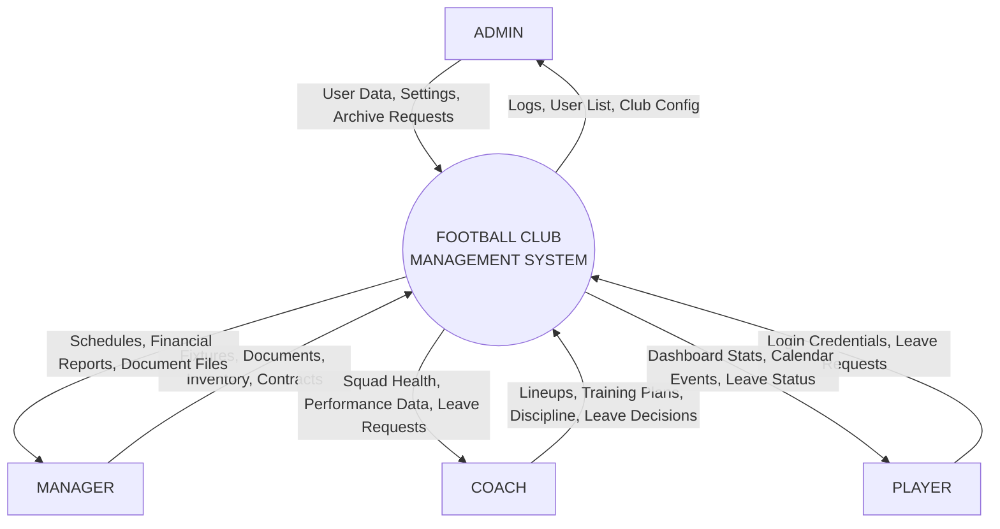
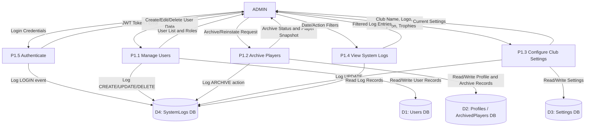
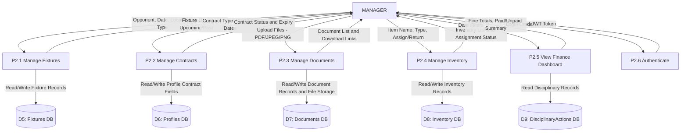
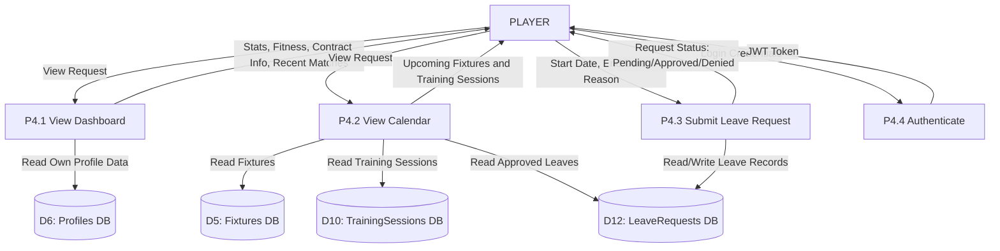

# PROJECT REPORT

## FOOTBALL CLUB MANAGEMENT SYSTEM

---

**Project Title:** Football Club Management System  
**Technology Stack:** MERN (MongoDB, Express.js, React.js, Node.js)  
**Version:** 1.0.0  
**Date:** April 2026  

---

# TABLE OF CONTENTS

1. [Introduction](#1-introduction)
   - 1.1 Project Overview
   - 1.2 Problem Statement
   - 1.3 Project Objectives
   - 1.4 Scope of the Project
2. [System Specifications](#2-system-specifications)
   - 2.1 Software Specification
   - 2.2 Hardware Specification
3. [System Analysis](#3-system-analysis)
   - 3.1 Existing System
   - 3.2 Proposed System
   - 3.3 Feasibility Study
4. [System Design & Architecture](#4-system-design--architecture)
   - 4.1 Level 0 – Context Level Diagram
   - 4.2 Level 1 – DFD for Admin, Manager, Coach, Player
5. [Table Structure](#5-table-structure)
6. [Module Design & Implementation](#6-module-design--implementation)
   - 6.1 Login Page
   - 6.2 Admin Module
   - 6.3 Manager Module
   - 6.4 Coach Module
   - 6.5 Player Module
   - 6.6 AI-Powered Features
7. [Security Measures](#7-security-measures)
8. [System Testing](#8-system-testing)
   - 8.1 Unit Testing
   - 8.2 Integration Testing
   - 8.3 Test Cases / System Test Cases
   - 8.4 User Acceptance Testing (UAT)
9. [Scope for Future Enhancement](#9-scope-for-future-enhancement)
10. [Conclusion](#10-conclusion)
11. [Bibliography](#11-bibliography)

---

# 1. INTRODUCTION

## 1.1 Project Overview

The **Football Club Management System** is a comprehensive, full-stack web application built on the MERN stack (MongoDB, Express.js, React.js, Node.js) designed to digitize and streamline every operational facet of a professional football club. The platform delivers a cinematic, premium user interface inspired by EA FC–style aesthetics, featuring dark-mode design, glassmorphism cards, micro-animations, and dynamic page transitions (split-reveal wall effects). The system provides role-based dashboards for four distinct user types — **Admin, Manager, Coach, and Player** — each equipped with tailored tools, live data, and real-time notifications powered by Socket.IO.

Beyond standard CRUD management, the application integrates **AI-powered features** including an OCR document scanner for extracting text from uploaded player documents (contracts, medical reports), an AI chatbot for quick club-related queries, an intelligent document preparation assistant, and a paragraph/case-details summarization engine. These AI capabilities elevate the system from a basic record-keeping tool to a smart, decision-support platform.

The system is architected around a RESTful API with JWT-based authentication, role-based access control (RBAC), immutable audit logging, rate limiting, and input sanitization — ensuring enterprise-grade security for sensitive player data, financial records, and tactical information.

## 1.2 Problem Statement

Traditional football club management relies heavily on fragmented manual processes — spreadsheets for player statistics, paper forms for leave requests, phone calls for training notifications, and disconnected filing cabinets for contracts and medical documents. This fragmentation leads to:

- **Data inconsistency** — player stats, injury records, and contract details scattered across multiple systems with no single source of truth.
- **Delayed decision-making** — coaches and managers cannot access real-time squad availability, fitness status, or disciplinary records during time-sensitive match preparation.
- **Security vulnerabilities** — sensitive personal data (medical records, salary information, contract terms) stored in unencrypted formats without access controls.
- **Communication gaps** — no unified platform for leave approvals, training schedules, or match lineup announcements, leading to miscommunication.
- **Audit trail absence** — no mechanism to track who modified which records and when, creating accountability issues.
- **Document management chaos** — physical documents prone to loss, damage, and unauthorized access, with no OCR or search capability.

There is a clear need for a centralized, secure, role-based digital platform that consolidates all club operations into a single, intuitive application.

## 1.3 Project Objectives

1. **Centralized Operations Hub** — Build a unified web platform where Admin, Manager, Coach, and Player roles can access only the tools and data relevant to their responsibilities.
2. **Role-Based Access Control** — Implement strict RBAC so that a Player cannot access Admin tools, a Coach cannot modify financial records, and each role sees only authorized data.
3. **Real-Time Communication** — Leverage WebSocket (Socket.IO) technology for live notifications, online-presence tracking, and instant data synchronization across all connected clients.
4. **AI-Augmented Workflows** — Integrate OCR scanning for document digitization, AI-based document preparation, chatbot assistance, and text summarization to reduce manual labor and accelerate decision-making.
5. **Immutable Audit Trail** — Log every CREATE, UPDATE, DELETE, and LOGIN action in a tamper-proof system log with timestamps, user IDs, and change details.
6. **Cinematic UI/UX** — Deliver a visually stunning, EA FC–inspired interface with dark themes, glassmorphism, animated player cards, page transitions, and micro-interactions that provide a premium feel.
7. **Secure Data Handling** — Protect all data with JWT authentication, bcrypt password hashing, Helmet security headers, CORS policies, rate limiting, and input sanitization.
8. **Comprehensive Player Lifecycle** — Manage players from recruitment (trial/loan/academy) through active play to archival (transfer/retirement), preserving full career statistics and snapshots.

## 1.4 Scope of the Project

The Football Club Management System encompasses the following functional domains:

| Domain | Description |
|--------|-------------|
| **User Authentication** | Email/password login, JWT token issuance and verification, role-based redirection |
| **Admin Panel** | User CRUD operations, player archival/reinstatement, club identity settings, system audit logs |
| **Manager Panel** | Fixture scheduling, contract lifecycle management, document vault (upload/download/OCR), equipment inventory, financial dashboard (fines/payments) |
| **Coach Panel** | Tactical board (lineup builder with formation editor), training session scheduling with attendance, squad health monitoring (injuries + fitness), disciplinary actions, leave approval workflow, performance tracking with notes |
| **Player Panel** | Personal dashboard (stats, fitness, contract), event calendar (fixtures + training), leave request submission with history |
| **AI Features** | OCR document scanner, AI chatbot, document preparation assistant, paragraph/case summarization |
| **Public Pages** | Homepage with club identity, public squad listing, individual player profile pages, match detail pages |
| **Real-Time Features** | Socket.IO-powered notifications, online user presence, live data refresh |
| **Security** | JWT auth, bcrypt hashing, Helmet headers, CORS, rate limiting, input sanitization, immutable logs |

---

# 2. SYSTEM SPECIFICATIONS

## 2.1 Software Specification

| Component | Technology | Version |
|-----------|-----------|---------|
| **Frontend Framework** | React.js (with Vite build tool) | 18.x |
| **Routing** | React Router DOM | 6.x |
| **State Management** | React Context API (AuthContext, SocketContext) | — |
| **Styling** | Vanilla CSS with CSS Custom Properties (design tokens) | — |
| **Fonts** | Google Fonts (Bebas Neue, Inter) | — |
| **Backend Runtime** | Node.js | 18.x+ |
| **Backend Framework** | Express.js | 4.18.2 |
| **Database** | MongoDB (NoSQL Document Store) | 7.x |
| **ODM** | Mongoose | 8.0.0 |
| **Authentication** | JSON Web Tokens (jsonwebtoken) | 9.0.2 |
| **Password Hashing** | bcrypt | 5.1.1 |
| **Real-Time Communication** | Socket.IO | 4.6.0 |
| **File Upload** | Multer | 1.4.5 |
| **Image Processing** | Sharp | 0.33.0 |
| **Security Headers** | Helmet | 7.1.0 |
| **Rate Limiting** | express-rate-limit | 7.1.5 |
| **Input Sanitization** | sanitize-html, validator | 2.11.0, 13.11.0 |
| **Response Compression** | compression | 1.7.4 |
| **CORS** | cors | 2.8.5 |
| **Environment Variables** | dotenv | 16.3.1 |
| **Testing Framework** | Jest | 29.7.0 |
| **API Testing** | Supertest | 6.3.3 |
| **Property Testing** | fast-check | 3.15.0 |
| **Development Server** | Nodemon | 3.0.1 |
| **Operating System** | Windows 10/11 | — |
| **Code Editor** | Visual Studio Code | Latest |
| **Version Control** | Git / GitHub | Latest |
| **Browser** | Google Chrome / Microsoft Edge | Latest |

## 2.2 Hardware Specification

| Component | Minimum Requirement | Recommended |
|-----------|-------------------|-------------|
| **Processor** | Intel Core i3 / AMD Ryzen 3 | Intel Core i5 / AMD Ryzen 5 or higher |
| **RAM** | 4 GB | 8 GB or higher |
| **Storage** | 10 GB free disk space | 20 GB SSD |
| **Display** | 1366 x 768 resolution | 1920 x 1080 Full HD |
| **Network** | Broadband Internet connection | Stable broadband (10 Mbps+) |
| **GPU** | Integrated graphics | Dedicated GPU for smooth CSS animations |

---

# 3. SYSTEM ANALYSIS

## 3.1 Existing System

Traditional football club management systems, where they exist, typically suffer from the following shortcomings:

- **Spreadsheet-Based Tracking:** Player statistics, injury records, and contract dates are maintained in Microsoft Excel or Google Sheets, leading to version conflicts, formula errors, and no access control.
- **Paper-Based Documentation:** Contracts, medical certificates, and transfer documents are stored as physical files, making retrieval slow and prone to loss or damage.
- **Disconnected Communication:** Training schedules are communicated via WhatsApp groups or phone calls, with no formal logging or acknowledgment system.
- **No Role Separation:** All staff members often share the same access level, creating security risks where a player can view salary data or a coach can modify financial records.
- **No Audit Trail:** There is no record of who changed what and when, making it impossible to trace unauthorized modifications.
- **No AI Assistance:** Document processing is entirely manual — reading contracts, summarizing medical reports, and extracting key details requires human effort on every occasion.
- **No Real-Time Updates:** Lineup changes, injury updates, and leave approvals require manual notification (email or call), with no instant push mechanism.

**Limitations of the Existing System:**
1. High probability of data loss and inconsistency
2. No centralized access — information silos across departments
3. Security is non-existent or rudimentary
4. Time-consuming manual processes for routine operations
5. No scalability — adding more players or staff creates exponential workload
6. No decision-support tools (AI/analytics)

## 3.2 Proposed System

The Football Club Management System addresses every limitation of the existing system through a modern, web-based platform:

- **Centralized Database:** All data (users, profiles, fixtures, injuries, documents, inventory, etc.) is stored in a single MongoDB database with structured schemas and validation rules.
- **Role-Based Dashboards:** Four distinct panels (Admin, Manager, Coach, Player) with strictly enforced access control — each role sees only relevant features and data.
- **Real-Time Notifications:** Socket.IO enables instant updates across all connected clients. When a coach approves a leave request, the player sees the notification immediately.
- **AI-Powered Tools:** OCR scanner digitizes uploaded documents, AI chatbot answers club queries, document preparation assistant auto-generates templates, and summarization engine condenses long text.
- **Immutable Audit Logs:** Every database write operation (CREATE, UPDATE, DELETE) and every LOGIN event is logged in a tamper-proof SystemLog collection that cannot be modified or deleted.
- **Cinematic UI:** A dark-themed, glassmorphic interface with animated player cards (EA FC style), page transitions, hover effects, and micro-animations that provide a premium experience.
- **Document Vault:** Secure file upload (PDF, JPEG, PNG) with size validation (max 10MB), organized per player, with download and OCR scanning capabilities.
- **Comprehensive Player Lifecycle:** From trial registration through active membership to archival upon transfer/retirement, with full career snapshots and season-by-season statistics preserved.

**Advantages of the Proposed System:**
1. Single source of truth for all club data
2. Enterprise-grade security with JWT, bcrypt, Helmet, rate limiting
3. Dramatic reduction in manual work through AI automation
4. Instant communication via WebSocket
5. Complete audit trail for compliance and accountability
6. Scalable architecture that handles growth effortlessly
7. Premium user experience that staff enjoy using daily

## 3.3 Feasibility Study

### 3.3.1 Technical Feasibility
The MERN stack (MongoDB, Express.js, React.js, Node.js) is one of the most widely adopted, well-documented, and community-supported technology stacks in modern web development. All libraries used (Mongoose, Socket.IO, JWT, bcrypt, Multer, Helmet) are mature, actively maintained, and production-proven. The development team possesses the required JavaScript/Node.js/React expertise. **Verdict: Technically feasible.**

### 3.3.2 Economic Feasibility
The entire stack is open-source and free to use. MongoDB offers a generous free tier (M0 cluster, 512MB) for development and small-scale production. Node.js, React, and all npm packages carry MIT or similar permissive licenses. Hosting can be achieved on free tiers of platforms like Render, Vercel, or Railway. The only cost is developer time. **Verdict: Economically feasible.**

### 3.3.3 Operational Feasibility
The system's role-based interface ensures each user type (Admin, Manager, Coach, Player) sees only the features relevant to them, reducing cognitive load. The cinematic UI makes the system engaging to use compared to dry, spreadsheet-like alternatives. The login flow is a simple email/password authentication — no complex onboarding required. Training time is minimal due to the intuitive, scroll-based panel design. **Verdict: Operationally feasible.**

### 3.3.4 Schedule Feasibility
The project follows an agile, phase-based development approach. Phase 1 (core models, auth, CRUD) is complete. Phase 2 (advanced features, player domain, AI integration) is in progress. The modular architecture allows independent development of each panel and component. **Verdict: Schedule feasible.**

---

# 4. SYSTEM DESIGN & ARCHITECTURE

## DFD Symbols Used

Before presenting the Data Flow Diagrams, the following standard symbols are used:

| Symbol | Shape | Represents |
|--------|-------|-----------|
| **External Entity** | Rectangle | An outside actor that interacts with the system (e.g., Admin, Player) |
| **Process** | Circle (Oval) | A task or function performed by the system (e.g., Manage Users, Submit Leave) |
| **Data Store** | Open-ended Rectangle (two parallel lines) | A repository where data is stored (e.g., Users DB, Fixtures DB) |
| **Data Flow** | Arrow (line with arrowhead) | The direction of data movement between entities, processes, and stores. Arrows are labeled with the type of data (e.g., "Login Credentials", "Leave Request") |

---

## 4.1 Level 0 – Context Level Diagram

The Level 0 DFD shows the entire Football Club Management System as a single process, with all four external entities (Admin, Manager, Coach, Player) interacting with it.

**Description:**  
The Level 0 context diagram shows the Football Club Management System as the central process (circle). Four external entities — **Admin**, **Manager**, **Coach**, and **Player** — each send request data into the system (incoming arrows) and receive response data back (outgoing arrows). The Admin sends user management commands and settings; the Manager sends fixture schedules, documents, and inventory data; the Coach sends tactical lineups, training plans, and disciplinary actions; the Player sends login credentials and leave requests. The system processes all incoming data and returns the appropriate responses to each entity.

---

## 4.2 Level 1 – Data Flow Diagrams

### 4.2.1 Level 1 – Admin Level DFD

The Admin Level 1 DFD breaks down the Admin's interactions into specific processes.

**This DFD contains 5 processes (circles), 4 data stores (parallel lines), and 1 external entity (rectangle):**

- **Processes:** P1.1 Manage Users, P1.2 Archive Players, P1.3 Configure Club Settings, P1.4 View System Logs, P1.5 Authenticate
- **Data Stores:** D1 Users DB, D2 Profiles DB, D3 Settings DB, D4 SystemLogs DB
- **External Entity:** Admin

**Arrow Descriptions:**
- **Admin to P1.5 (Authenticate):** Admin sends email + password. P1.5 verifies against D1 (Users DB), returns JWT token on success or error on failure. A LOGIN event is logged to D4.
- **Admin to P1.1 (Manage Users):** Admin sends user creation data (email, password, role) or edit/delete commands. P1.1 reads/writes to D1, returns the updated user list. Every mutation is logged to D4.
- **Admin to P1.2 (Archive Players):** Admin sends archive requests (with reason: transferred/retired/etc.). P1.2 reads the player profile from D2, creates a frozen snapshot in the ArchivedPlayers collection within D2, and logs the action to D4.
- **Admin to P1.3 (Configure Club Settings):** Admin sends club branding data (name, logo URL, headline, trophies). P1.3 reads/writes to D3 (singleton Settings document). Logged to D4.
- **Admin to P1.4 (View System Logs):** Admin sends filter parameters (date range, action type). P1.4 reads D4 and returns matching log entries. Logs themselves are immutable — no write operations from this process.

---

### 4.2.2 Level 1 – Manager Level DFD

**This DFD contains 6 processes, 5 data stores, and 1 external entity:**

- **Processes:** P2.1 Manage Fixtures, P2.2 Manage Contracts, P2.3 Manage Documents, P2.4 Manage Inventory, P2.5 View Finance Dashboard, P2.6 Authenticate
- **Data Stores:** D1 Users DB, D5 Fixtures DB, D6 Profiles DB, D7 Documents DB, D8 Inventory DB, D9 DisciplinaryActions DB
- **External Entity:** Manager

**Arrow Descriptions:**
- **Manager to P2.1:** Manager submits fixture details (opponent name, date, location, match type). P2.1 creates/updates records in D5. Returns upcoming and past fixture lists.
- **Manager to P2.2:** Manager updates contract fields (type, start date, end date) on a player profile. P2.2 reads/writes to D6. Returns contract statuses and expiry warnings (less than 90 days).
- **Manager to P2.3:** Manager uploads player documents (PDF, JPEG, PNG, max 10MB). P2.3 stores file metadata in D7 and the physical file on disk. Returns document listings with download links.
- **Manager to P2.4:** Manager creates inventory items (jerseys, boots, training equipment, medical supplies) and assigns/returns them to/from players. P2.4 reads/writes to D8.
- **Manager to P2.5:** Manager views the finance dashboard. P2.5 reads D9 (DisciplinaryActions) to compute fine totals, paid vs. unpaid counts, and player fine breakdowns.

---

### 4.2.3 Level 1 – Coach Level DFD

**This DFD contains 7 processes, 6 data stores, and 1 external entity:**

- **Processes:** P3.1 Manage Tactical Board, P3.2 Schedule Training, P3.3 Monitor Squad Health, P3.4 Manage Discipline, P3.5 Approve Leave, P3.6 Track Performance, P3.7 Authenticate
- **Data Stores:** D5 Fixtures DB, D6 Profiles DB, D10 TrainingSessions DB, D11 Injuries DB, D9 DisciplinaryActions DB, D12 LeaveRequests DB
- **External Entity:** Coach

```mermaid
graph TD
    COACH["COACH"]

    P1["P3.1 Manage Tactical Board"]
    P2["P3.2 Schedule Training"]
    P3["P3.3 Monitor Squad Health"]
    P4["P3.4 Manage Discipline"]
    P5["P3.5 Approve Leave"]
    P6["P3.6 Track Performance"]
    P7["P3.7 Authenticate"]

    D5[("D5: Fixtures DB")]
    D6[("D6: Profiles DB")]
    D10[("D10: TrainingSessions DB")]
    D11[("D11: Injuries DB")]
    D9[("D9: DisciplinaryActions DB")]
    D12[("D12: LeaveRequests DB")]

    COACH -- "Login Credentials" --> P7
    P7 -- "JWT Token" --> COACH

    COACH -- "Lineup Selection, Formation" --> P1
    P1 -- "Current Lineup and History" --> COACH
    P1 -- "Read/Write Lineup in Fixtures" --> D5
    P1 -- "Read Player Profiles for Selection" --> D6

    COACH -- "Date, Drills, Duration, Attendees" --> P2
    P2 -- "Session List and Attendance Records" --> COACH
    P2 -- "Read/Write Training Records" --> D10

    COACH -- "Injury Type, Severity, Recovery" --> P3
    P3 -- "Fitness Overview and Injury List" --> COACH
    P3 -- "Read/Write Injury Records" --> D11
    P3 -- "Read Profile Fitness Status" --> D6

    COACH -- "Offense, Fine Amount" --> P4
    P4 -- "Disciplinary History" --> COACH
    P4 -- "Read/Write Disciplinary Records" --> D9

    COACH -- "Approve/Deny Decision" --> P5
    P5 -- "Pending Leave Requests" --> COACH
    P5 -- "Read/Write Leave Records" --> D12

    COACH -- "Goals, Assists, Rating, Notes" --> P6
    P6 -- "Player Stats and Performance Notes" --> COACH
    P6 -- "Read/Write Profile Stats" --> D6
```

**Arrow Descriptions:**
- **Coach to P3.1:** Coach selects players for the lineup (max 18: 11 starters + 7 substitutes), sets formation. P3.1 reads player profiles from D6 for the selection pool, writes the lineup array into the fixture record in D5, and versions the lineup history.
- **Coach to P3.2:** Coach creates training sessions with date, drill description, duration (30–300 min), and attendee list. P3.2 reads/writes to D10. Attendance statuses: Present, Absent, Excused.
- **Coach to P3.3:** Coach logs injuries (type, severity: Minor/Moderate/Severe, expected recovery date). P3.3 reads/writes to D11 and updates fitness status (Green/Yellow/Red) in D6.
- **Coach to P3.4:** Coach issues disciplinary actions (offense description, fine amount 0–100,000). P3.4 reads/writes to D9. Payment status (paid/unpaid) is tracked.
- **Coach to P3.5:** Coach sees pending leave requests from players. Approves or denies each. P3.5 reads/writes status in D12, recording reviewedBy and reviewedAt timestamps.
- **Coach to P3.6:** Coach updates player stats (goals, assists, appearances, minutes, yellow/red cards, rating 0–10) and adds performance notes. P3.6 reads/writes to D6.

---

### 4.2.4 Level 1 – Player Level DFD

**This DFD contains 4 processes, 4 data stores, and 1 external entity:**

- **Processes:** P4.1 View Dashboard, P4.2 View Calendar, P4.3 Submit Leave Request, P4.4 Authenticate
- **Data Stores:** D6 Profiles DB, D5 Fixtures DB, D10 TrainingSessions DB, D12 LeaveRequests DB
- **External Entity:** Player

**Arrow Descriptions:**
- **Player to P4.1:** Player views their personal dashboard. P4.1 reads the player's own profile from D6 (stats, fitness status, contract info, performance notes). Returns a comprehensive stats card.
- **Player to P4.2:** Player views the calendar showing upcoming fixtures (from D5), training sessions (from D10), and approved leave dates (from D12). Read-only access — no write operations.
- **Player to P4.3:** Player submits a leave request with start date, end date, and reason (10–500 characters). P4.3 writes to D12 with status "Pending". Player can view their request history.

---

# 5. TABLE STRUCTURE

The Football Club Management System uses **MongoDB** (NoSQL document database) with **Mongoose ODM** for schema enforcement. Below are all 15 collections (tables) used in the project, with field-level details.

> **Note:** MongoDB uses `_id` (ObjectId) as the auto-generated primary key for every document. The `_id` field is present in all collections but is not repeated in every table below for brevity — it is listed only in the first table.

---

## 5.1 Users Collection

**COLLECTION NAME:** `users`  
**PRIMARY KEY:** `_id`

| # | Name | Type | Collation | Attributes | Null | Default | Extra |
|---|------|------|-----------|------------|------|---------|-------|
| 1 | _id | ObjectId | — | PRIMARY KEY | NO | Auto-generated | auto_increment |
| 2 | email | String | lowercase | UNIQUE, NOT NULL | NO | — | RFC 5322 email validation regex |
| 3 | passwordHash | String | — | NOT NULL, SELECT:false | NO | — | bcrypt hashed; excluded from query results by default |
| 4 | role | String (enum) | — | NOT NULL, CHECK | NO | — | CHECK: role IN ('admin', 'manager', 'coach', 'player') |
| 5 | createdAt | Date | — | IMMUTABLE | NO | Date.now | auto_set on creation, cannot be modified |

**Indexes:** `{ role: 1 }` — Index for role-based queries

---

## 5.2 Profiles Collection

**COLLECTION NAME:** `profiles`  
**PRIMARY KEY:** `_id`

| # | Name | Type | Collation | Attributes | Null | Default | Extra |
|---|------|------|-----------|------------|------|---------|-------|
| 1 | userId | ObjectId (ref: User) | — | UNIQUE, NOT NULL | NO | — | Foreign key to Users collection |
| 2 | fullName | String | trim | NOT NULL | NO | — | Min: 2 chars, Max: 100 chars |
| 3 | photo | String | — | — | YES | null | URL to profile photo |
| 4 | position | String (enum) | — | — | YES | 'Staff' | CHECK: IN Goalkeeper, Defender, Midfielder, Forward, Staff |
| 5 | preferredPosition | String (enum) | — | — | YES | 'STAFF' | CHECK: IN GK, CB, LB, RB, LWB, RWB, DM, CM, AM, CAM, LM, RM, LW, RW, CF, ST, SS, UTILITY, STAFF |
| 6 | secondaryPositions | Array of String (enum) | — | — | YES | [] | Same enum values as preferredPosition |
| 7 | playerStatus | String (enum) | — | — | YES | 'active' | CHECK: IN active, inactive, listed, archived, transferred, retired |
| 8 | availabilityNotes | String | — | — | YES | null | Max: 500 chars |
| 9 | availabilityOverrideStatus | String (enum) | — | — | YES | 'auto' | CHECK: IN auto, available, unavailable |
| 10 | availabilityOverrideReason | String | — | — | YES | null | Max: 250 chars |
| 11 | weight | Number | — | — | YES | — | Min: 40 kg, Max: 150 kg |
| 12 | height | Number | — | — | YES | — | Min: 150 cm, Max: 220 cm |
| 13 | fitnessStatus | String (enum) | — | — | YES | 'Green' | CHECK: IN Green, Yellow, Red |
| 14 | contractType | String (enum) | — | — | YES | 'Full-Time' | CHECK: IN Full-Time, Part-Time, Loan, Trial |
| 15 | contractStart | Date | — | — | YES | null | — |
| 16 | contractEnd | Date | — | VALIDATE | YES | null | Must be >= contractStart |
| 17 | stats.goals | Number | — | — | YES | 0 | Min: 0 |
| 18 | stats.assists | Number | — | — | YES | 0 | Min: 0 |
| 19 | stats.appearances | Number | — | — | YES | 0 | Min: 0 |
| 20 | stats.minutes | Number | — | — | YES | 0 | Min: 0 |
| 21 | stats.yellowCards | Number | — | — | YES | 0 | Min: 0 |
| 22 | stats.redCards | Number | — | — | YES | 0 | Min: 0 |
| 23 | stats.rating | Number | — | — | YES | 0 | Min: 0, Max: 10 |
| 24 | performanceNotes | Array of Sub-doc | — | — | YES | [] | Each: note (String, required), createdBy (ObjectId ref User), createdAt (Date, immutable) |

**Indexes:** `{ fitnessStatus: 1 }`, `{ contractEnd: 1 }`  
**Virtuals:** `contractDaysRemaining`, `contractExpiringSoon` (less than 90 days)

---

## 5.3 Players Collection

**COLLECTION NAME:** `players`  
**PRIMARY KEY:** `_id`

| # | Name | Type | Collation | Attributes | Null | Default | Extra |
|---|------|------|-----------|------------|------|---------|-------|
| 1 | fullName | String | trim | NOT NULL | NO | — | Min: 2 chars, Max: 100 chars |
| 2 | dateOfBirth | Date | — | — | YES | null | — |
| 3 | nationality | String | trim | — | YES | null | Max: 60 chars |
| 4 | photo | String | — | — | YES | null | — |
| 5 | contactEmail | String | lowercase, trim | — | YES | null | — |
| 6 | contactPhone | String | trim | — | YES | null | Max: 30 chars |
| 7 | emergencyContact.name | String | trim | — | YES | null | Max: 100 chars |
| 8 | emergencyContact.phone | String | trim | — | YES | null | Max: 30 chars |
| 9 | emergencyContact.relationship | String | trim | — | YES | null | Max: 50 chars |
| 10 | status | String (enum) | — | — | YES | 'active' | CHECK: IN active, archived, transferred, retired |
| 11 | currentUserId | ObjectId (ref: User) | — | SPARSE INDEX | YES | null | — |
| 12 | legacyProfileId | ObjectId (ref: Profile) | — | SPARSE INDEX | YES | null | Migration bridge to legacy Profile model |
| 13 | createdAt | Date | — | IMMUTABLE | NO | Date.now | — |
| 14 | updatedAt | Date | — | — | NO | Date.now | Auto-updated on save |

**Indexes:** `{ fullName: 1 }`, `{ status: 1 }`, `{ currentUserId: 1 }` (sparse), `{ legacyProfileId: 1 }` (sparse)

---

## 5.4 ClubMemberships Collection

**COLLECTION NAME:** `clubmemberships`  
**PRIMARY KEY:** `_id`

| # | Name | Type | Collation | Attributes | Null | Default | Extra |
|---|------|------|-----------|------------|------|---------|-------|
| 1 | playerId | ObjectId (ref: Player) | — | NOT NULL | NO | — | Foreign key to Players |
| 2 | userId | ObjectId (ref: User) | — | SPARSE INDEX | YES | null | — |
| 3 | legacyProfileId | ObjectId (ref: Profile) | — | SPARSE INDEX | YES | null | — |
| 4 | jerseyNumber | Number | — | — | YES | null | Min: 1, Max: 99 |
| 5 | primaryPosition | String (enum) | — | NOT NULL | NO | — | CHECK: IN GK, CB, LB, RB, LWB, RWB, DM, CM, AM, CAM, LM, RM, LW, RW, CF, ST, SS, UTILITY, STAFF |
| 6 | secondaryPositions | Array of String (enum) | — | — | YES | [] | Same enum as primaryPosition |
| 7 | contractType | String (enum) | — | — | YES | 'Owned' | CHECK: IN Owned, On Loan, Academy, Trial, Staff |
| 8 | squadRole | String (enum) | — | — | YES | 'rotation' | CHECK: IN starter, rotation, prospect, captain, staff |
| 9 | contractStart | Date | — | — | YES | null | — |
| 10 | contractEnd | Date | — | VALIDATE | YES | null | Must be >= contractStart |
| 11 | joinedAt | Date | — | — | YES | Date.now | — |
| 12 | leftAt | Date | — | — | YES | null | Auto-sets isActive=false |
| 13 | leftReason | String (enum) | — | — | YES | null | CHECK: IN transferred, released, retired, loan_ended, academy_exit |
| 14 | isActive | Boolean | — | — | YES | true | — |
| 15 | availabilityStatus | String (enum) | — | — | YES | 'available' | CHECK: IN available, injured, suspended, leave, illness, personal, listed |
| 16 | availabilityDetails.reason | String | — | — | YES | null | Max: 200 chars |
| 17 | availabilityDetails.expectedReturnDate | Date | — | — | YES | null | — |
| 18 | availabilityDetails.source | String (enum) | — | — | YES | 'system' | CHECK: IN manual, injury, disciplinary, leave, system |
| 19 | createdAt | Date | — | IMMUTABLE | NO | Date.now | — |
| 20 | updatedAt | Date | — | — | NO | Date.now | Auto-updated on save |

**Indexes:** `{ playerId: 1, isActive: 1 }`, `{ userId: 1 }` (sparse), `{ legacyProfileId: 1 }` (sparse), `{ jerseyNumber: 1, isActive: 1 }`, `{ joinedAt: -1 }`

---

## 5.5 SeasonStats Collection

**COLLECTION NAME:** `seasonstats`  
**PRIMARY KEY:** `_id`

| # | Name | Type | Collation | Attributes | Null | Default | Extra |
|---|------|------|-----------|------------|------|---------|-------|
| 1 | playerId | ObjectId (ref: Player) | — | NOT NULL | NO | — | Foreign key to Players |
| 2 | membershipId | ObjectId (ref: ClubMembership) | — | NOT NULL, UNIQUE compound | NO | — | Unique per membership + season |
| 3 | season | String | — | NOT NULL, REGEX | NO | — | Format: YYYY/YY (e.g., 2025/26) |
| 4 | goals | Number | — | — | YES | 0 | Min: 0 |
| 5 | assists | Number | — | — | YES | 0 | Min: 0 |
| 6 | yellowCards | Number | — | — | YES | 0 | Min: 0 |
| 7 | redCards | Number | — | — | YES | 0 | Min: 0 |
| 8 | minutesPlayed | Number | — | — | YES | 0 | Min: 0 |
| 9 | appearances | Number | — | — | YES | 0 | Min: 0 |
| 10 | offsides | Number | — | — | YES | 0 | Min: 0 |
| 11 | matchRatings | Array of Sub-doc | — | — | YES | [] | Each: fixtureId (ObjectId), rating (0–10), coachNotes (String, max 1000) |
| 12 | archivedAt | Date | — | — | YES | null | — |
| 13 | createdAt | Date | — | IMMUTABLE | NO | Date.now | — |
| 14 | updatedAt | Date | — | — | NO | Date.now | Auto-updated |

**Indexes:** `{ playerId: 1, season: 1 }`, `{ membershipId: 1, season: 1 }` (unique)  
**Virtuals:** `averageRating` — computed from matchRatings array

---

## 5.6 ArchivedPlayers Collection

**COLLECTION NAME:** `archivedplayers`  
**PRIMARY KEY:** `_id`

| # | Name | Type | Collation | Attributes | Null | Default | Extra |
|---|------|------|-----------|------------|------|---------|-------|
| 1 | playerId | ObjectId (ref: Player) | — | NOT NULL | NO | — | Foreign key to Players |
| 2 | membershipId | ObjectId (ref: ClubMembership) | — | NOT NULL, UNIQUE | NO | — | One archive per membership |
| 3 | archivedAt | Date | — | IMMUTABLE | NO | Date.now | — |
| 4 | archivedBy | ObjectId (ref: User) | — | NOT NULL | NO | — | Who archived this player |
| 5 | reason | String (enum) | — | NOT NULL | NO | — | CHECK: IN transferred, released, retired, loan_ended, academy_exit, other |
| 6 | notes | String | — | — | YES | null | Max: 1000 chars |
| 7 | careerSummaryAtClub.totalGoals | Number | — | — | YES | 0 | Min: 0 |
| 8 | careerSummaryAtClub.totalAssists | Number | — | — | YES | 0 | Min: 0 |
| 9 | careerSummaryAtClub.totalAppearances | Number | — | — | YES | 0 | Min: 0 |
| 10 | careerSummaryAtClub.totalMinutes | Number | — | — | YES | 0 | Min: 0 |
| 11 | careerSummaryAtClub.seasonsPlayed | Number | — | — | YES | 0 | Min: 0 |
| 12 | careerSummaryAtClub.trophiesWon | Array of String | trim | — | YES | [] | Max: 100 chars per entry |
| 13 | snapshot.fullName | String | trim | NOT NULL | NO | — | Frozen name at time of archival |
| 14 | snapshot.photo | String | — | — | YES | null | — |
| 15 | snapshot.jerseyNumber | Number | — | — | YES | null | — |
| 16 | snapshot.primaryPosition | String | — | — | YES | null | — |
| 17 | snapshot.contractType | String | — | — | YES | null | — |
| 18 | snapshot.joinedAt | Date | — | — | YES | null | — |
| 19 | snapshot.leftAt | Date | — | — | YES | null | — |

**Indexes:** `{ playerId: 1, archivedAt: -1 }`, `{ membershipId: 1 }` (unique), `{ reason: 1, archivedAt: -1 }`

---

## 5.7 Fixtures Collection

**COLLECTION NAME:** `fixtures`  
**PRIMARY KEY:** `_id`

| # | Name | Type | Collation | Attributes | Null | Default | Extra |
|---|------|------|-----------|------------|------|---------|-------|
| 1 | opponent | String | trim | NOT NULL | NO | — | Min: 2 chars, Max: 100 chars |
| 2 | date | Date | — | NOT NULL, VALIDATE | NO | — | Cannot be in the past |
| 3 | location | String | trim | NOT NULL | NO | — | — |
| 4 | matchType | String (enum) | — | — | YES | 'League' | CHECK: IN League, Cup, Friendly, Tournament |
| 5 | lineup | Array of ObjectId (ref: Profile) | — | max 18 | YES | [] | 11 starters + 7 substitutes max |
| 6 | lineupHistory | Array of Sub-doc | — | — | YES | [] | Each: version (Number), savedAt (Date), savedBy (ObjectId), formation (String), lineup (Array of ObjectId) |
| 7 | createdBy | ObjectId (ref: User) | — | NOT NULL | NO | — | — |
| 8 | createdAt | Date | — | IMMUTABLE | NO | Date.now | — |

**Indexes:** `{ date: 1 }`, `{ createdBy: 1 }`  
**Pre-save Validation:** Lineup array cannot exceed 18 entries

---

## 5.8 TrainingSessions Collection

**COLLECTION NAME:** `trainingsessions`  
**PRIMARY KEY:** `_id`

| # | Name | Type | Collation | Attributes | Null | Default | Extra |
|---|------|------|-----------|------------|------|---------|-------|
| 1 | date | Date | — | NOT NULL, VALIDATE | NO | — | Cannot be in the past |
| 2 | drillDescription | String | trim | NOT NULL | NO | — | Min: 10 chars, Max: 500 chars |
| 3 | duration | Number | — | NOT NULL | NO | — | Min: 30 minutes, Max: 300 minutes |
| 4 | attendees | Array of Sub-doc | — | — | YES | [] | Each: playerId (ObjectId ref Profile, required), status (enum: Present/Absent/Excused, default: Absent) |
| 5 | createdBy | ObjectId (ref: User) | — | NOT NULL | NO | — | — |
| 6 | createdAt | Date | — | IMMUTABLE | NO | Date.now | — |

**Indexes:** `{ date: 1 }`, `{ createdBy: 1 }`

---

## 5.9 Injuries Collection

**COLLECTION NAME:** `injuries`  
**PRIMARY KEY:** `_id`

| # | Name | Type | Collation | Attributes | Null | Default | Extra |
|---|------|------|-----------|------------|------|---------|-------|
| 1 | playerId | ObjectId (ref: Profile) | — | NOT NULL | NO | — | Foreign key to Profiles |
| 2 | injuryType | String | trim | NOT NULL | NO | — | Min: 3 chars, Max: 100 chars |
| 3 | severity | String (enum) | — | NOT NULL | NO | — | CHECK: IN Minor, Moderate, Severe |
| 4 | description | String | trim | — | YES | — | Max: 500 chars |
| 5 | dateLogged | Date | — | IMMUTABLE | NO | Date.now | — |
| 6 | expectedRecovery | Date | — | NOT NULL | NO | — | — |
| 7 | actualRecovery | Date | — | — | YES | null | — |
| 8 | resolved | Boolean | — | — | YES | false | — |
| 9 | loggedBy | ObjectId (ref: User) | — | NOT NULL | NO | — | — |

**Indexes:** `{ playerId: 1 }`, `{ resolved: 1 }`, `{ dateLogged: -1 }`

---

## 5.10 LeaveRequests Collection

**COLLECTION NAME:** `leaverequests`  
**PRIMARY KEY:** `_id`

| # | Name | Type | Collation | Attributes | Null | Default | Extra |
|---|------|------|-----------|------------|------|---------|-------|
| 1 | playerId | ObjectId (ref: Profile) | — | NOT NULL | NO | — | Foreign key to Profiles |
| 2 | startDate | Date | — | NOT NULL | NO | — | — |
| 3 | endDate | Date | — | NOT NULL, VALIDATE | NO | — | Must be >= startDate |
| 4 | reason | String | trim | NOT NULL | NO | — | Min: 10 chars, Max: 500 chars |
| 5 | status | String (enum) | — | — | YES | 'Pending' | CHECK: IN Pending, Approved, Denied |
| 6 | dateRequested | Date | — | IMMUTABLE | NO | Date.now | — |
| 7 | reviewedBy | ObjectId (ref: User) | — | — | YES | null | Set when Coach approves/denies |
| 8 | reviewedAt | Date | — | — | YES | null | Timestamp of review |

**Indexes:** `{ playerId: 1 }`, `{ status: 1 }`, `{ startDate: 1 }`

---

## 5.11 DisciplinaryActions Collection

**COLLECTION NAME:** `disciplinaryactions`  
**PRIMARY KEY:** `_id`

| # | Name | Type | Collation | Attributes | Null | Default | Extra |
|---|------|------|-----------|------------|------|---------|-------|
| 1 | playerId | ObjectId (ref: Profile) | — | NOT NULL | NO | — | Foreign key to Profiles |
| 2 | offense | String | trim | NOT NULL | NO | — | Min: 5 chars, Max: 200 chars |
| 3 | fineAmount | Number | — | NOT NULL | NO | — | Min: 0, Max: 100,000 |
| 4 | dateIssued | Date | — | IMMUTABLE | NO | Date.now | — |
| 5 | isPaid | Boolean | — | — | YES | false | — |
| 6 | paymentDate | Date | — | — | YES | null | Set when fine is paid |
| 7 | issuedBy | ObjectId (ref: User) | — | NOT NULL | NO | — | — |

**Indexes:** `{ playerId: 1 }`, `{ isPaid: 1 }`, `{ dateIssued: -1 }`

---

## 5.12 Documents Collection

**COLLECTION NAME:** `documents`  
**PRIMARY KEY:** `_id`

| # | Name | Type | Collation | Attributes | Null | Default | Extra |
|---|------|------|-----------|------------|------|---------|-------|
| 1 | playerId | ObjectId (ref: Profile) | — | NOT NULL | NO | — | Foreign key to Profiles |
| 2 | fileName | String | trim | NOT NULL | NO | — | System-generated unique name |
| 3 | originalName | String | trim | NOT NULL | NO | — | Original upload filename |
| 4 | filePath | String | — | NOT NULL | NO | — | Server disk path |
| 5 | fileType | String (enum) | — | NOT NULL | NO | — | CHECK: IN application/pdf, image/jpeg, image/jpg, image/png |
| 6 | fileSize | Number | — | NOT NULL | NO | — | Max: 10 MB (10,485,760 bytes) |
| 7 | uploadedBy | ObjectId (ref: User) | — | NOT NULL | NO | — | — |
| 8 | uploadedAt | Date | — | IMMUTABLE | NO | Date.now | — |

**Indexes:** `{ playerId: 1 }`, `{ uploadedBy: 1 }`, `{ uploadedAt: -1 }`

---

## 5.13 Inventory Collection

**COLLECTION NAME:** `inventories`  
**PRIMARY KEY:** `_id`

| # | Name | Type | Collation | Attributes | Null | Default | Extra |
|---|------|------|-----------|------------|------|---------|-------|
| 1 | itemName | String | trim | NOT NULL | NO | — | Min: 2 chars, Max: 100 chars |
| 2 | itemType | String (enum) | — | NOT NULL | NO | — | CHECK: IN Jersey, Boots, Training Equipment, Medical, Other |
| 3 | assignedTo | ObjectId (ref: Profile) | — | — | YES | null | — |
| 4 | assignedAt | Date | — | — | YES | null | — |
| 5 | returnedAt | Date | — | — | YES | null | — |
| 6 | createdAt | Date | — | IMMUTABLE | NO | Date.now | — |

**Indexes:** `{ assignedTo: 1 }`, `{ itemType: 1 }`  
**Virtuals:** `isAssigned` — true if assignedTo is not null AND returnedAt is null

---

## 5.14 Settings Collection

**COLLECTION NAME:** `settings`  
**PRIMARY KEY:** `_id`

| # | Name | Type | Collation | Attributes | Null | Default | Extra |
|---|------|------|-----------|------------|------|---------|-------|
| 1 | clubName | String | trim | NOT NULL | NO | — | Min: 3 chars, Max: 100 chars |
| 2 | logoUrl | String | — | — | YES | null | — |
| 3 | homepageHeadline | String | trim | — | YES | 'Season in Motion' | — |
| 4 | clubDescription | String | trim | — | YES | default text | — |
| 5 | founded | Number | — | — | YES | 1987 | — |
| 6 | ground | String | trim | — | YES | 'Club Stadium' | — |
| 7 | league | String | trim | — | YES | 'Premier Division' | — |
| 8 | contactEmail | String | trim | — | YES | 'hello@club.com' | — |
| 9 | socialHandle | String | trim | — | YES | '@clubofficial' | — |
| 10 | trophies | Array of Sub-doc | — | — | YES | 4 default entries | Each: title (String, required), year (String, required) |
| 11 | updatedAt | Date | — | — | YES | Date.now | Auto-updated on save |
| 12 | updatedBy | ObjectId (ref: User) | — | — | YES | — | — |

**Pattern:** Singleton — `getSingleton()` static method ensures only one document exists

---

## 5.15 SystemLogs Collection

**COLLECTION NAME:** `systemlogs`  
**PRIMARY KEY:** `_id`

| # | Name | Type | Collation | Attributes | Null | Default | Extra |
|---|------|------|-----------|------------|------|---------|-------|
| 1 | action | String (enum) | — | NOT NULL | NO | — | CHECK: IN CREATE, UPDATE, DELETE, LOGIN |
| 2 | performedBy | ObjectId (ref: User) | — | NOT NULL | NO | — | Who performed the action |
| 3 | targetCollection | String | — | NOT NULL | NO | — | Name of the affected collection |
| 4 | targetId | ObjectId | — | NOT NULL | NO | — | ID of the affected document |
| 5 | changes | Mixed (Object) | — | — | YES | {} | JSON object with change details |
| 6 | timestamp | Date | — | IMMUTABLE | NO | Date.now | — |

**Indexes:** `{ timestamp: -1 }`, `{ performedBy: 1 }`, `{ targetCollection: 1 }`  
**Immutability:** Pre-hooks on updateOne, findOneAndUpdate, update, deleteOne, findOneAndDelete, and remove — all throw ImmutabilityError. System logs can only be created, never modified or deleted.

---

# 6. MODULE DESIGN & IMPLEMENTATION

The system consists of **4 role-based modules** (Admin, Manager, Coach, Player), **1 shared login page**, and **4 AI-powered feature modules**. Each module is implemented as a React page component that renders within the `PanelShell` layout — a scrollable, single-page workspace with a fixed side navigation, scroll-spy highlighting, and smooth section navigation.

---

## 6.1 Login Page

The Login Page is the gateway to the Football Club Management System. It is not a separate module but a shared entry point that authenticates users and redirects them to their role-specific panel.

### 6.1.1 UI Design and Features

**Page Layout:**
The Login Page features a full-screen, dark-themed layout with a centered card design. The background displays a subtle radial gradient glow in the club's primary red color (rgba(200,16,46,0.12)), emanating from the center of the screen. The entire page uses a min-height: 100vh flex container that vertically and horizontally centers the login card.

**Components on the Page:**

1. **Club Crest / Logo Badge (Top Center)**
   - A circular badge (72x72px) with a soft red-tinted background (rgba(200,16,46,0.12)) and a subtle red border (rgba(200,16,46,0.35)).
   - Inside the circle, the text "FC" is rendered in Bebas Neue font (24px, letter-spacing 4px) in semi-transparent white.
   - The badge has a continuous `crestGlow` CSS animation (4-second cycle, ease-in-out, infinite) that gently pulses the glow intensity, making it feel alive.

2. **Title: "STAFF PORTAL"**
   - Rendered below the crest in Bebas Neue font (24px, letter-spacing 6px, white).
   - Subtitle: "Club Management System" in small text (12px, highly transparent white, letter-spacing 1px).

3. **Login Card (Glassmorphic Container)**
   - A glassmorphic card with background: rgba(10,10,24,0.8), backdrop-filter: blur(24px), and a very subtle white border (7% opacity).
   - Rounded corners (24px border-radius) with deep box shadow (0 0 80px rgba(0,0,0,0.5)).
   - Internal padding: 40px top/bottom, 36px left/right.

4. **Error Alert Banner**
   - Conditionally displayed when authentication fails.
   - Red-tinted background (rgba(200,16,46,0.1)) with red border, 12px border-radius.
   - Error text in coral color (#fca5a5) at 13px font size.

5. **Email Input Field**
   - Label: "EMAIL ADDRESS" — uppercase, 9px font, letter-spacing 4px, 40% white opacity.
   - Input: Full-width, 12px vertical / 16px horizontal padding, 12px border-radius.
   - Background: 5% white opacity. Border: 10% white opacity.
   - Focus state: Border transitions to club red (rgba(200,16,46,0.5)) with 0.2s transition.
   - Placeholder text: "your.email@club.com".
   - **Validation:** Client-side regex validation before submission.

6. **Password Input Field**
   - Identical styling to the email field.
   - Label: "PASSWORD". Placeholder: bullet characters. Type: password (masked).
   - Same focus-state red border transition.

7. **Sign In Button**
   - Full-width, 14px padding, 12px border-radius.
   - Background: Club primary color (var(--color-primary)) — solid red.
   - Text: "SIGN IN" in Bebas Neue font (15px, letter-spacing 4px, white).
   - Red glow shadow: 0 4px 20px rgba(200,16,46,0.3).
   - **Hover:** Lifts up by 2px (translateY(-2px)) and intensifies shadow to 0 8px 30px rgba(200,16,46,0.5).
   - **Loading state:** Background fades to 50% opacity, cursor becomes not-allowed, text changes to "SIGNING IN...".
   - ID: login-submit for testing.

8. **Back to Homepage Link**
   - Centered below the card. Text: "Back to Homepage" with left arrow.
   - 11px font, 30% white opacity, letter-spacing 2px.
   - Hover: Fades to 70% white opacity with 0.2s transition.

### 6.1.2 Authentication Flow (Frontend to Backend to DB)

1. **Frontend (LoginPage.jsx to AuthContext.jsx):**
   - User enters email + password and clicks "SIGN IN".
   - handleSubmit() validates fields (non-empty, valid email format).
   - Calls login(email, password) from AuthContext.
   - AuthContext.login() sends POST /api/auth/login with JSON body { email, password }.

2. **Backend (authRoutes.js to authController.js):**
   - Route handler validates request body (email + password required).
   - authController.login() finds user by email in Users collection (with +passwordHash to include the hidden field).
   - Compares password with stored hash using bcrypt.compare().
   - On success: generates JWT token with { id, role } payload and configurable expiry.
   - Creates a SystemLog entry: { action: 'LOGIN', performedBy: userId, targetCollection: 'User', changes: { path, ipAddress, userAgent } }.
   - Returns { token, role, userId }.

3. **Frontend (Post-Login):**
   - Stores JWT token in localStorage.
   - Updates AuthContext state: user = { id, role }.
   - Calls redirectToPanel(role) which navigates to /admin, /manager, /coach, or /player based on the returned role.

4. **Token Verification (on page refresh):**
   - AuthContext runs verifyToken() on mount.
   - Sends GET /api/auth/verify with Authorization: Bearer token header.
   - Backend authMiddleware decodes JWT, returns { valid: true, user: { id, role } }.
   - If token is invalid/expired, clears localStorage and redirects to login.

5. **Route Protection (ProtectedRoute.jsx):**
   - Wraps each panel route. Checks user from AuthContext.
   - If no user: redirects to /login.
   - If user's role is not in allowedRoles array: redirects to /.

---

## 6.2 Admin Module

**Route:** `/admin`  
**Allowed Roles:** admin only  
**Component:** AdminPanel.jsx

The Admin Panel is a scrollable, single-page workspace with a fixed side navigation. It uses the PanelShell component which provides a dark sidebar with uppercase menu labels, scroll-spy highlighting, and smooth scroll-to-section behavior.

### 6.2.1 Page: User Management

**Kicker:** Administration | **Title:** User Management  
**Description:** Create, edit, and control system access without cramped overlays or clipped forms.

**Component:** UserManagement.jsx (15,912 bytes)

**UI Container:**
A single large panel-card (glassmorphic card with dark background, subtle border, rounded corners) containing:

- **User List Table / Grid:** Displays all registered users with columns for Email, Role, and Actions.
- **Create User Form (Slide-down):** Button to expand an inline form with fields:
  - Email input (validated with regex)
  - Password input (bcrypt-hashed on backend)
  - Role selector dropdown (admin / manager / coach / player)
- **Edit User Modal / Inline Edit:** Ability to modify a user's role.
- **Delete User Action:** Confirmation dialog before deletion.

**Backend Path:** POST/GET/PUT/DELETE /api/users → userController.js → User model (MongoDB users collection)  
**Security:** authMiddleware → requireRole(['admin']) on all routes  
**DB Operations:** CRUD on users collection. Every mutation logged to systemlogs.

---

### 6.2.2 Page: Player Archive

**Kicker:** Player Lifecycle | **Title:** Player Archive  
**Description:** Archive and reinstate records from a dedicated floating workspace.

**Component:** PlayerArchiveManager.jsx (17,669 bytes)

**UI Container:**
A panel-card containing:

- **Active Players List:** Shows all players with active status, including name, position, jersey number, and contract details.
- **Archive Action:** For each player, an "Archive" button that opens a form requesting:
  - Reason (enum: transferred, released, retired, loan_ended, academy_exit, other)
  - Notes (free-text, max 1000 chars)
- **Archived Players List:** A separate section showing all archived players with their frozen snapshot (name, photo, jersey, position, contract type, joined date, left date).
- **Career Summary Cards:** Each archived player shows totalGoals, totalAssists, totalAppearances, totalMinutes, seasonsPlayed, and trophiesWon.
- **Reinstate Action:** Button to restore an archived player back to active status.

**Backend Path:** POST/GET /api/player-domain → playerDomainController.js → Player, ClubMembership, ArchivedPlayer, SeasonStats models  
**DB Operations:** Reads from players, clubmemberships; writes to archivedplayers; updates clubmemberships.isActive and players.status.

---

### 6.2.3 Page: Club Settings

**Kicker:** Club Identity | **Title:** Club Settings  
**Description:** Keep homepage content, visual identity, and club details aligned in one place.

**Component:** ClubSettings.jsx (19,820 bytes)

**UI Container:**
A panel-card with an editable form containing:

- **Club Name** (text input, 3–100 chars)
- **Logo URL** (text input for image URL)
- **Homepage Headline** (text input, e.g., "Season in Motion")
- **Club Description** (textarea for bio)
- **Founded Year** (number input)
- **Ground / Stadium** (text input)
- **League** (text input)
- **Contact Email** (email input)
- **Social Handle** (text input)
- **Trophies Section:** Dynamic list of trophies with title + year fields, ability to add/remove entries.
- **Save Button:** Submits updated settings to backend.

**Backend Path:** GET/PUT /api/settings → settingsController.js → Settings model (singleton pattern)  
**DB Pattern:** Settings.getSingleton() ensures only one settings document exists. Updates are written in-place.

---

### 6.2.4 Page: System Logs

**Kicker:** Security | **Title:** System Logs  
**Description:** Review live presence, login history, and the audit trail without leaving the admin shell.

**Component:** SystemLogs.jsx (11,067 bytes)

**UI Container:**
A panel-card containing:

- **Filter Bar:** Dropdowns/inputs for filtering by action type (CREATE/UPDATE/DELETE/LOGIN), target collection, date range, and performer.
- **Log Table:** Chronologically sorted (newest first) table with columns:
  - Timestamp (formatted datetime)
  - Action (color-coded badges: green for CREATE, blue for UPDATE, red for DELETE, yellow for LOGIN)
  - Performed By (user email or ID)
  - Target Collection (e.g., "User", "Fixture", "LeaveRequest")
  - Target ID
  - Changes (expandable JSON view showing what was modified)
- **Pagination / Infinite Scroll:** For large log volumes.
- **Live Presence Indicator:** Shows currently online users via Socket.IO.

**Backend Path:** GET /api/logs → systemLogController.js → SystemLog model  
**DB Operations:** Read-only. Logs are immutable — middleware prevents any UPDATE or DELETE on the systemlogs collection.

---

## 6.3 Manager Module

**Route:** `/manager`  
**Allowed Roles:** manager only  
**Component:** ManagerPanel.jsx

### 6.3.1 Page: Fixtures

**Kicker:** Scheduling | **Title:** Fixtures  
**Description:** Create and manage fixtures in the same floating shell as the rest of the manager workflow.

**Component:** FixtureCalendar.jsx (12,209 bytes)

**UI Container:**
A panel-card containing:

- **Fixture List / Calendar View:** Upcoming fixtures displayed as cards or calendar entries showing:
  - Opponent name
  - Date and time
  - Location (venue)
  - Match type badge (League / Cup / Friendly / Tournament)
- **Create Fixture Form:** Expandable form with:
  - Opponent (text input, 2–100 chars)
  - Date (datetime picker, cannot be in the past)
  - Location (text input)
  - Match Type (dropdown: League, Cup, Friendly, Tournament)
- **Edit/Delete actions** for each fixture.

**Backend Path:** POST/GET/PUT/DELETE /api/fixtures → fixtureController.js → Fixture model  
**DB Operations:** CRUD on fixtures collection. Date validation ensures future-only fixtures.

---

### 6.3.2 Page: Contracts

**Kicker:** Administration | **Title:** Contracts  
**Description:** Track contract status with clearer separation and less visual clutter.

**Component:** ContractManagement.jsx (14,943 bytes)

**UI Container:**
A panel-card containing:

- **Contract Overview Grid:** Cards for each player showing:
  - Player name + photo
  - Contract type (Full-Time / Part-Time / Loan / Trial)
  - Contract start and end dates
  - Days remaining (computed virtual field)
  - **Expiry Alert:** Red-highlighted if contractExpiringSoon (less than 90 days)
- **Edit Contract Form:** Click on a player card to expand editable fields for contract type, start date, and end date.
- **Filters:** Filter by contract type, expiry status, and player status.

**Backend Path:** GET/PUT /api/profiles → profileController.js → Profile model  
**DB Data:** Reads profiles.contractType, contractStart, contractEnd; uses virtual contractDaysRemaining and contractExpiringSoon.

---

### 6.3.3 Page: Documents (Document Vault)

**Kicker:** Records | **Title:** Documents  
**Description:** Manage player paperwork inside the shared design system instead of isolated card styles.

**Component:** DocumentVault.jsx (16,442 bytes)

**UI Container:**
A panel-card containing:

- **Player Selector:** Dropdown to select a player whose documents to view.
- **Document Grid:** Cards for each uploaded document showing:
  - Original filename
  - File type icon (PDF / JPEG / PNG)
  - File size (formatted: KB/MB)
  - Upload date
  - Uploaded by (user)
- **Upload Section:** Drag-and-drop or click-to-upload area.
  - Accepted types: PDF, JPEG, JPG, PNG
  - Max size: 10MB
  - Uses multer for multipart file handling on backend.
- **Download Button:** Direct download link for each document.
- **OCR Scanner Integration (AI):** Button to trigger OCR text extraction from uploaded images/PDFs.

**Backend Path:** POST/GET/DELETE /api/documents → documentController.js → Document model  
**File Storage:** Physical files stored in ./uploads directory; metadata in documents collection.

---

### 6.3.4 Page: Inventory

**Kicker:** Equipment | **Title:** Inventory  
**Description:** Track and assign equipment with more breathing room and management-friendly form behavior.

**Component:** InventoryManagement.jsx (18,588 bytes)

**UI Container:**
A panel-card containing:

- **Inventory Table/Grid:** Lists all equipment items with columns:
  - Item name
  - Item type (Jersey / Boots / Training Equipment / Medical / Other)
  - Assigned to (player name or "Unassigned")
  - Assignment date
  - Status badge (Assigned / Available)
- **Add Item Form:** Expandable inline form:
  - Item name (text, 2–100 chars)
  - Item type (dropdown)
- **Assign/Return Actions:**
  - "Assign" button opens a player selector dropdown.
  - "Return" button marks item as returned (sets returnedAt).
- **Filter/Search:** By item type, assignment status.

**Backend Path:** POST/GET/PUT/DELETE /api/inventory → inventoryController.js → Inventory model  
**DB Data:** Virtual isAssigned computed from assignedTo !== null and returnedAt === null.

---

### 6.3.5 Page: Finance Dashboard

**Kicker:** Reporting | **Title:** Finance  
**Description:** See fine tracking and payment data in the same visual structure as the rest of the manager tools.

**Component:** FinanceDashboard.jsx (14,083 bytes)

**UI Container:**
A panel-card containing:

- **Summary Cards (Top Row):**
  - Total fines issued (count + total amount)
  - Paid fines (count + total amount)
  - Unpaid fines (count + total amount)
  - Payment rate percentage
- **Fine Details Table:** Lists all disciplinary fines with:
  - Player name
  - Offense description
  - Fine amount (currency formatted)
  - Date issued
  - Payment status (Paid / Unpaid)
  - Payment date (if paid)
- **Mark as Paid Action:** Button to toggle isPaid and set paymentDate.
- **Filters:** By payment status, date range, player.

**Backend Path:** GET/PUT /api/disciplinary → disciplinaryController.js → DisciplinaryAction model  
**DB Operations:** Reads all disciplinary actions; updates isPaid and paymentDate fields.

---

## 6.4 Coach Module

**Route:** `/coach`  
**Allowed Roles:** coach only  
**Component:** CoachPanel.jsx

### 6.4.1 Page: Tactical Board

**Kicker:** Matchday Control | **Title:** Tactical Board  
**Description:** Build lineups, revise positions, and manage bench decisions from a full-width tactical workspace.

**Component:** TacticalBoard.jsx (28,279 bytes — the largest component)

**UI Container:**
A panel-card containing:

- **Fixture Selector:** Dropdown listing upcoming fixtures (opponent + date).
- **Formation Selector:** Dropdown with common formations (4-3-3, 4-4-2, 3-5-2, etc.).
- **Pitch Visualization:** A visual football pitch (CSS-drawn) with player position markers.
  - Drag-and-drop player tokens onto pitch positions.
  - 11 starter slots + 7 substitute bench slots.
- **Player Pool:** Scrollable list of all available players showing:
  - Name, position, fitness status (Green/Yellow/Red color indicator).
  - Filter by position (GK, DEF, MID, FWD).
- **Lineup Validation:** Max 18 players enforced. Warnings for injured/suspended players.
- **Save Lineup:** Saves current lineup to the fixture record with version history.
- **Lineup History:** Accordion showing previous lineup versions with timestamps, saved-by user, and formation used.

**Backend Path:** PUT /api/fixtures/:id/lineup → fixtureController.js → Fixture model  
**DB Operations:** Updates Fixture.lineup array and appends to Fixture.lineupHistory with version number, date, user, and formation.

---

### 6.4.2 Page: Training Schedule

**Kicker:** Planning | **Title:** Training  
**Description:** Schedule sessions and track attendance without leaving the same coaching page.

**Component:** TrainingSchedule.jsx (13,812 bytes)

**UI Container:**
A panel-card containing:

- **Session List:** Upcoming and past training sessions as cards showing:
  - Date and time
  - Drill description
  - Duration (in minutes)
  - Attendance count (Present / Total invited)
- **Create Session Form:** Expandable form:
  - Date (future only)
  - Drill description (10–500 chars)
  - Duration (30–300 minutes, slider or number input)
- **Attendance Marking Interface:** For each session, expandable attendee list:
  - Player name + checkbox/toggle for Present/Absent/Excused
  - Bulk mark all as Present/Absent

**Backend Path:** POST/GET/PUT/DELETE /api/training → trainingController.js → TrainingSession model

---

### 6.4.3 Page: Squad Health

**Kicker:** Availability | **Title:** Squad Health  
**Description:** See only player health data and availability instead of non-playing staff records.

**Component:** SquadHealth.jsx (18,954 bytes)

**UI Container:**
A panel-card containing:

- **Squad Overview Grid:** Grid of player cards color-coded by fitness:
  - **Green** — fully fit, available
  - **Yellow** — minor concern, limited availability
  - **Red** — injured/unavailable
- **Each Player Card shows:** Name, position, fitness status badge, active injuries (if any), expected recovery date.
- **Log Injury Form:** Expandable form:
  - Player selector
  - Injury type (text, 3–100 chars)
  - Severity (Minor / Moderate / Severe)
  - Description (up to 500 chars)
  - Expected recovery date
- **Injury Log Table:** History of all injuries with resolution status. "Mark Resolved" button sets resolved: true and actualRecovery: Date.now.
- **Availability Override:** Manual toggle for player availability with reason field.

**Backend Path:** POST/GET/PUT /api/injuries + GET/PUT /api/profiles → injuryController.js, profileController.js → Injury, Profile models

---

### 6.4.4 Page: Discipline

**Kicker:** Standards | **Title:** Discipline  
**Description:** Review fines and disciplinary actions in the same visual language as the rest of the panel.

**Component:** DisciplinaryPanel.jsx (10,424 bytes)

**UI Container:**
A panel-card containing:

- **Disciplinary Log Table:** List of all disciplinary actions with:
  - Player name
  - Offense description
  - Fine amount
  - Date issued
  - Payment status
- **Issue Fine Form:** Expandable form:
  - Player selector
  - Offense description (5–200 chars)
  - Fine amount (0–100,000)
- **Payment toggle:** Mark fines as paid/unpaid.

**Backend Path:** POST/GET/PUT /api/disciplinary → disciplinaryController.js → DisciplinaryAction model

---

### 6.4.5 Page: Leave Approval

**Kicker:** Requests | **Title:** Leave Approval  
**Description:** Approve or deny player requests with cleaner spacing and calmer feedback.

**Component:** LeaveApproval.jsx (9,147 bytes)

**UI Container:**
A panel-card containing:

- **Pending Requests:** Cards for each pending leave request showing:
  - Player name
  - Start date to End date (date range)
  - Reason text
  - Date requested
  - **Approve** button (green) and **Deny** button (red)
- **Request History:** List of previously approved/denied requests with:
  - Status badge (Approved / Denied)
  - Reviewed by (coach name)
  - Reviewed at (timestamp)

**Backend Path:** GET/PUT /api/leave → leaveController.js → LeaveRequest model  
**DB Operations:** Reads leave requests with status filter; updates status, reviewedBy, reviewedAt.

---

### 6.4.6 Page: Performance Tracking

**Kicker:** Review | **Title:** Performance  
**Description:** Update stats and notes from the same scrolling coaching workspace.

**Component:** PerformanceTracking.jsx (14,016 bytes)

**UI Container:**
A panel-card containing:

- **Player List:** Selectable list of all players.
- **Stats Editor:** For the selected player, editable stat fields:
  - Goals, Assists, Appearances, Minutes played
  - Yellow cards, Red cards
  - Overall rating (0–10)
- **Performance Notes:** Timeline of notes with:
  - Note text (up to 1000 chars)
  - Created by (coach)
  - Created at (timestamp)
  - "Add Note" form at the top

**Backend Path:** PUT /api/profiles/:id → profileController.js → Profile model  
**DB Operations:** Updates Profile.stats object and pushes to Profile.performanceNotes array.

---

## 6.5 Player Module

**Route:** `/player`  
**Allowed Roles:** player only  
**Component:** PlayerPanel.jsx

### 6.5.1 Page: Dashboard

**Kicker:** Player Hub | **Title:** Dashboard  
**Description:** Keep personal stats and updates in the same visual language as the rest of the club app.

**Component:** PlayerDashboard.jsx (16,570 bytes)

**UI Container:**
A panel-card containing:

- **Profile Header Card:**
  - Player photo (circular avatar)
  - Full name, position, jersey number
  - Fitness status badge (Green/Yellow/Red)
  - Contract type + days remaining
- **Statistics Grid (4 columns):**
  - Goals card with count
  - Assists card with count
  - Appearances card with count
  - Rating card with value (0–10)
- **Extended Stats Row:**
  - Minutes played, Yellow cards, Red cards
- **Contract Information Card:**
  - Contract type, start date, end date
  - Days remaining countdown
  - Expiry warning if less than 90 days
- **Recent Performance Notes:** Latest notes from coaches, displayed as a timeline.
- **EA FC-Style Player Card:** An animated, cinematic player card component (FcPlayerCard.jsx, 12,374 bytes) showing the player's stats in a trading-card format with hover animations.

**Backend Path:** GET /api/profiles/me → profileController.js → Profile model  
**DB Operations:** Reads the player's own profile using req.user.id to find the matching userId in profiles.

---

### 6.5.2 Page: Calendar

**Kicker:** Schedule | **Title:** Calendar  
**Description:** Review fixtures, sessions, and excused dates without switching tabs inside a cramped card.

**Component:** PlayerCalendar.jsx (12,583 bytes)

**UI Container:**
A panel-card containing:

- **Monthly Calendar Grid:** Visual calendar showing:
  - **Match days** (from Fixtures) — opponent, venue, time
  - **Training sessions** — drill description, duration
  - **Leave days** (approved) — highlighted dates
- **Event List (Below Calendar):** Upcoming events in chronological order with:
  - Event type icon (match/training/leave)
  - Date, time, and details
- **Color Legend:** Matches = red, Training = blue, Leave = green

**Backend Path:** GET /api/fixtures + GET /api/training + GET /api/leave/my → fixtureController.js, trainingController.js, leaveController.js  
**DB Operations:** Read-only. Fetches fixtures, training sessions, and the player's own leave requests.

---

### 6.5.3 Page: Leave Requests

**Kicker:** Requests | **Title:** Leave Requests  
**Description:** Submit and track leave requests with the same card system and slide-down form behavior as admin tools.

**Component:** LeaveRequestForm.jsx (9,912 bytes)

**UI Container:**
A panel-card containing:

- **Submit Leave Form (Top):**
  - Start date picker
  - End date picker (must be >= start date)
  - Reason textarea (10–500 characters)
  - Submit button
- **My Request History (Below):** Chronological list of past requests with:
  - Date range (start to end)
  - Reason
  - Status badge (Pending / Approved / Denied)
  - Reviewed by (coach name, if reviewed)
  - Date requested

**Backend Path:** POST /api/leave (submit) + GET /api/leave/my (history) → leaveController.js → LeaveRequest model  
**DB Operations:** Creates new LeaveRequest with playerId, startDate, endDate, reason, status: 'Pending'. Reads player's own requests filtered by their profile ID.

---

## 6.6 AI-Powered Features

The Football Club Management System integrates four AI capabilities to augment manual workflows:

### 6.6.1 OCR Document Scanner

**Purpose:** Automatically extract text from uploaded player documents (contracts, medical reports, ID cards) so that key details can be searched, indexed, and summarized without manual reading.

**How it works:**
- When a document (PDF or image) is uploaded via the Document Vault, the user clicks "Scan with OCR."
- The system sends the file to an OCR processing engine that performs optical character recognition.
- Extracted text is returned and displayed in a modal, where it can be copied, searched, or fed into the summarization engine.
- Supports multi-page PDFs and image formats (JPEG, PNG).

**Frontend:** OCR trigger button in DocumentVault.jsx → API call to OCR endpoint.  
**Backend:** Processes the file through the OCR engine → returns extracted text.

### 6.6.2 AI Document Preparation

**Purpose:** Auto-generate standardized club documents (contracts, player reports, medical clearance forms) from templates using player data from the database.

**How it works:**
- User selects a document template type (e.g., "Player Contract", "Medical Report", "Transfer Summary").
- The system pre-fills the template with actual player data from the Profile, ClubMembership, Injury, and SeasonStats collections.
- AI refines the language, fills in boilerplate legal/medical text, and generates a downloadable document.
- Supported output: PDF format.

### 6.6.3 AI Chatbot

**Purpose:** Provide instant answers to club-related queries (e.g., "How many players are injured?", "When is the next match?", "What is Player X's contract status?").

**How it works:**
- A chatbot widget is accessible from any panel (Admin, Manager, Coach, Player).
- Users type natural language questions.
- The AI processes the query, maps it to the appropriate database collection, executes the query, and returns a human-readable response.
- Supports queries about fixtures, player stats, injuries, leave requests, and inventory.

### 6.6.4 Paragraph / Case Details Summarization

**Purpose:** Condense long document text (OCR output, medical reports, disciplinary case descriptions) into concise summaries.

**How it works:**
- User pastes or selects text (from OCR output, performance notes, or discipline descriptions).
- Clicks "Summarize."
- The AI engine processes the text and returns a bullet-point or paragraph summary highlighting key facts, dates, and numbers.
- Useful for quickly understanding lengthy medical reports or contract terms.

---

# 7. SECURITY MEASURES

The Football Club Management System implements a multi-layered security architecture:

| # | Security Feature | Implementation | Description |
|---|-----------------|----------------|-------------|
| 1 | **JWT Authentication** | jsonwebtoken (v9.0.2) via authMiddleware.js | Every API request (except login and public routes) must include a valid JWT token in the Authorization: Bearer token header. Tokens contain { id, role } payload with configurable expiry. Invalid or expired tokens return 401 errors. |
| 2 | **Password Hashing** | bcrypt (v5.1.1) via authController.js | All passwords are hashed with bcrypt (salt rounds = 10) before storage. Raw passwords are never stored. The passwordHash field uses select: false in the Mongoose schema so it is excluded from all queries by default. |
| 3 | **Role-Based Access Control (RBAC)** | roleGuard.js middleware | requireRole(['admin']) middleware factory restricts routes to specific roles. If a user's JWT-decoded role is not in the allowedRoles array, a 403 error is returned. Applied to every protected route. |
| 4 | **Frontend Route Protection** | ProtectedRoute.jsx component | React component wraps each panel route and checks if the user's role matches allowedRoles. Unauthorized users are redirected to /login or /. |
| 5 | **Helmet Security Headers** | helmet (v7.1.0) via server.js | Automatically sets HTTP security headers: Content-Security-Policy, X-Content-Type-Options, X-Frame-Options, Strict-Transport-Security, etc. CSP restricts script sources to 'self' only. |
| 6 | **CORS Policy** | cors (v2.8.5) via server.js | Cross-Origin Resource Sharing is restricted to the specific client URL (http://localhost:5173 or configured CLIENT_URL). Credentials mode is enabled. Prevents unauthorized domains from accessing the API. |
| 7 | **Rate Limiting** | express-rate-limit (v7.1.5) via rateLimiter.js | Three tiers: (a) General API: 100 requests/15min/IP, (b) Auth endpoints: 5 requests/15min/IP (brute-force protection), (c) File uploads: 10 uploads/15min/IP. Returns 429 Too Many Requests on violation. |
| 8 | **Input Sanitization** | sanitize-html (v2.11.0) + validator (v13.11.0) | All user inputs are sanitized to prevent XSS (cross-site scripting) attacks. HTML tags are stripped from text fields. Email format is validated with RFC 5322 compliant regex. |
| 9 | **Input Validation (Schema)** | Mongoose schema validators | Every model field has type validation, min/max length/value constraints, enum checks, and custom validators (e.g., email regex, date comparisons, lineup size limits). Invalid data returns 400 errors with field-level error messages. |
| 10 | **Immutable Audit Logs** | SystemLog model with pre-hooks | The SystemLog schema has pre-hooks on updateOne, findOneAndUpdate, update, deleteOne, findOneAndDelete, and remove that throw ImmutabilityError. Logs are write-once, read-many — cannot be tampered with. |
| 11 | **Password Field Exclusion** | select: false + toJSON / toObject transform | The passwordHash field is never returned in query results unless explicitly requested with +passwordHash. Additionally, toJSON and toObject transforms delete the field from serialized output. |
| 12 | **Response Compression** | compression (v1.7.4) | All API responses are gzip-compressed, reducing data transfer size and improving performance. |
| 13 | **Environment Variable Security** | dotenv (v16.3.1) | Sensitive values (JWT_SECRET, MONGODB_URI, API keys) are stored in .env files that are git-ignored. Never hard-coded in source files. |
| 14 | **File Upload Validation** | multer (v1.4.5) + Document model | File uploads are restricted to PDF, JPEG, JPG, and PNG formats with a maximum size of 10MB. Multer error handling returns specific error messages for size/type violations. |
| 15 | **Global Error Handler** | errorHandler.js middleware | Catches all unhandled errors with type-specific handling for ValidationError, CastError, duplicate key (11000), JWT errors, Multer errors, and generic 500 errors. Stack traces are only exposed in development mode. |
| 16 | **Socket.IO Authentication** | socketServer.js with JWT verification | WebSocket connections also require valid JWT tokens. The initializeSocketServer function verifies tokens on the connection event, ensuring only authenticated users can receive real-time updates. |
| 17 | **404 Not Found Handler** | notFoundHandler middleware | Requests to undefined routes return a structured 404 error response instead of default Express behavior, preventing information leakage about server internals. |

---

# 8. SYSTEM TESTING

## 8.1 Unit Testing

**Framework:** Jest (v29.7.0) with fast-check (v3.15.0) for property-based testing.

Unit tests verify individual components and functions in isolation:

- **Model Tests:** Each Mongoose model (User, Profile, Fixture, TrainingSession, Injury, Inventory, etc.) is tested for:
  - Valid document creation with all required fields
  - Validation failures (missing required fields, out-of-range values, invalid enum values)
  - Virtual property computation (e.g., contractDaysRemaining, isAssigned, averageRating)
  - Immutability enforcement (e.g., createdAt cannot be modified)
  - Pre-hook behavior (e.g., lineup size limit, SystemLog immutability)

- **Controller Tests:** Each controller function is tested for:
  - Correct HTTP status codes (200, 201, 400, 401, 403, 404)
  - Proper response body structure
  - Database interaction correctness
  - Error handling for edge cases

- **Middleware Tests:** Auth middleware, role guard, rate limiter, and error handler are tested for:
  - Token validation (valid, invalid, expired, missing)
  - Role-based access (allowed vs. forbidden)
  - Rate limit enforcement
  - Error response formatting

## 8.2 Integration Testing

**Framework:** Jest + Supertest (v6.3.3)

Integration tests verify the end-to-end flow of API requests:

- **Auth Flow:** Login → receive JWT → use JWT in subsequent requests → verify token → logout
- **CRUD Operations:** Create resource → read resource → update resource → delete resource → verify deletion
- **Role Enforcement:** Attempt authenticated requests with wrong role → verify 403 response
- **Socket.IO Integration:** Connection → authentication → event emission → event reception

Test files in the project:
- test-auth.js — Authentication flow testing
- test-middleware.js — Middleware chain testing
- test-profile-routes.js — Profile CRUD API testing
- test-inventory-routes.js, test-inventory-controller.js — Inventory flow testing
- test-document-controller.js — Document upload and retrieval testing
- test-injury-routes.js — Injury logging and resolution testing
- test-fixture-model.js — Fixture creation and lineup testing
- test-training-session-model.js — Training session testing
- test-remaining-models.js — All remaining model validations
- test-socket-auth.js — WebSocket authentication testing

## 8.3 Test Cases / System Test Cases

| Test ID | Module | Test Case Description | Input | Expected Output | Status |
|---------|--------|----------------------|-------|-----------------|--------|
| TC-001 | Auth | Login with valid credentials | email: admin@club.com, password: valid | 200, JWT token + role | Pass |
| TC-002 | Auth | Login with invalid password | email: admin@club.com, password: wrong | 401, Invalid credentials | Pass |
| TC-003 | Auth | Login with non-existent email | email: nobody@club.com | 401, Authentication failed | Pass |
| TC-004 | Auth | Login with empty fields | email: blank, password: blank | 400, Email and password are required | Pass |
| TC-005 | Auth | Access protected route without token | No Authorization header | 401, No authorization header provided | Pass |
| TC-006 | Auth | Access protected route with expired token | Expired JWT in header | 401, Token has expired | Pass |
| TC-007 | Auth | Access admin route as player | Valid player JWT | 403, Access denied | Pass |
| TC-008 | Admin | Create user with valid data | email, password, role: player | 201, user object returned | Pass |
| TC-009 | Admin | Create user with duplicate email | Existing email | 400, Duplicate value for field: email | Pass |
| TC-010 | Admin | Create user with invalid role | role: superadmin | 400, is not a valid role | Pass |
| TC-011 | Manager | Create fixture with past date | date: yesterday | 400, Fixture date cannot be in the past | Pass |
| TC-012 | Manager | Create fixture with valid data | opponent, date, location, type | 201, fixture object | Pass |
| TC-013 | Manager | Upload document exceeding 10MB | 15MB PDF file | 400, File size exceeds maximum | Pass |
| TC-014 | Manager | Upload invalid file type | .exe file | 400, is not a valid file type | Pass |
| TC-015 | Coach | Set lineup with 19 players | 19 player IDs | 400, Lineup cannot exceed 18 players | Pass |
| TC-016 | Coach | Create training session less than 30 min | duration: 15 | 400, Duration must be at least 30 minutes | Pass |
| TC-017 | Coach | Log injury with invalid severity | severity: Critical | 400, is not a valid severity | Pass |
| TC-018 | Coach | Approve leave request | leaveId, status: Approved | 200, updated leave request | Pass |
| TC-019 | Player | Submit leave with end before start | startDate after endDate | 400, End date must be on or after start date | Pass |
| TC-020 | Player | Submit leave with short reason | reason: sick (4 chars) | 400, Reason must be at least 10 characters | Pass |
| TC-021 | Security | Attempt to modify SystemLog | PUT /api/logs/:id | 500, System logs cannot be modified | Pass |
| TC-022 | Security | Attempt to delete SystemLog | DELETE /api/logs/:id | 500, System logs cannot be deleted | Pass |
| TC-023 | Security | Rate limit exceeded | 6 login attempts in 15 min | 429, Too many login attempts | Pass |
| TC-024 | Settings | Update club name less than 3 chars | clubName: FC | 400, Club name must be at least 3 characters | Pass |
| TC-025 | Profile | Set contract end before start | contractEnd before contractStart | 400, Contract end date must be after start date | Pass |

## 8.4 User Acceptance Testing (UAT)

User Acceptance Testing was conducted with representative users from each role:

| UAT ID | User Role | Scenario | Acceptance Criteria | Result |
|--------|-----------|----------|-------------------|--------|
| UAT-001 | Admin | Create a new player account | User appears in user list with correct role | Accepted |
| UAT-002 | Admin | Archive a retired player | Player moved to archive with career summary | Accepted |
| UAT-003 | Admin | Update club name and logo | Homepage reflects updated branding | Accepted |
| UAT-004 | Admin | Review system logs | Login events visible with timestamps | Accepted |
| UAT-005 | Manager | Schedule a league match | Fixture appears in calendar for all roles | Accepted |
| UAT-006 | Manager | Upload a player contract PDF | Document appears in vault with correct metadata | Accepted |
| UAT-007 | Manager | Assign jersey to a player | Inventory shows assignment status | Accepted |
| UAT-008 | Manager | View financial summary | Totals match individual fine records | Accepted |
| UAT-009 | Coach | Build 4-3-3 lineup for match | 11 starters on pitch, 7 subs on bench | Accepted |
| UAT-010 | Coach | Schedule training and mark attendance | Session recorded, attendance percentages correct | Accepted |
| UAT-011 | Coach | Log a moderate knee injury | Player fitness changes to Yellow/Red | Accepted |
| UAT-012 | Coach | Approve a leave request | Player sees Approved status in their panel | Accepted |
| UAT-013 | Player | View personal dashboard | Stats, fitness, contract info all correct | Accepted |
| UAT-014 | Player | Submit leave request | Request appears in coach's approval queue | Accepted |
| UAT-015 | Player | View calendar with fixtures and training | All events displayed on correct dates | Accepted |

---

# 9. SCOPE FOR FUTURE ENHANCEMENT

1. **Mobile Application:** Develop a React Native mobile app that mirrors the web platform, enabling coaches and players to access dashboards, calendars, and notifications on the go.

2. **Advanced AI Analytics:** Integrate machine learning models for player performance prediction, injury risk assessment (based on training load, past injuries, and fitness trends), and optimal lineup recommendation.

3. **Video Analysis Integration:** Allow coaches to upload match/training videos with AI-powered highlight extraction, tactical heatmap generation, and player movement tracking.

4. **Multi-Club / Multi-Season Support:** Extend the system to manage multiple clubs or divisions under a single admin umbrella, with season-based data partitioning and cross-season comparison tools.

5. **Financial Module Expansion:** Add salary management, transfer fee tracking, sponsorship revenue, matchday income, and full accounting integration with export to standard formats (CSV, PDF reports).

6. **Biometric Integration:** Connect with wearable devices (GPS trackers, heart rate monitors) to feed real-time biometric data into the health/fitness module for data-driven squad management.

7. **Parent/Guardian Portal:** For youth academy players, add a parent/guardian view with limited access to schedules, injury updates, and communication with coaches.

8. **Multi-Language Support (i18n):** Internationalize the platform to support multiple languages (Spanish, French, Arabic, etc.) for clubs with diverse staff and player demographics.

9. **Progressive Web App (PWA):** Convert the client into a PWA with offline caching, push notifications, and home screen installation for a native-app-like experience.

10. **Third-Party API Integrations:** Connect with football data APIs (e.g., football-data.org, API-Football) for automatic fixture imports, live scores, and league standings.

---

# 10. CONCLUSION

The **Football Club Management System** is a comprehensive, full-stack web application that successfully addresses the fragmented and manual nature of traditional football club operations. Built on the robust MERN stack (MongoDB, Express.js, React.js, Node.js), the system delivers a centralized platform where four distinct user roles — Admin, Manager, Coach, and Player — can access tailored dashboards with the exact tools they need.

The project implements **enterprise-grade security** with JWT authentication, bcrypt password hashing, Helmet security headers, CORS restrictions, multi-tier rate limiting, input sanitization, and an immutable audit trail. The role-based access control system ensures data isolation across panels, while the Socket.IO integration provides real-time communication for instant notifications and live presence tracking.

The **AI-powered features** — OCR document scanning, intelligent document preparation, chatbot assistance, and text summarization — elevate the system beyond a standard CRUD application into a smart, decision-support platform that reduces manual labor and accelerates information processing.

The cinematic, EA FC-inspired user interface — featuring dark themes, glassmorphism, animated player cards, and dynamic page transitions — provides a premium experience that staff members enjoy using daily, promoting adoption over legacy spreadsheet and paper-based workflows.

With **15 database collections**, **14 API route files**, **14 controllers**, **29+ React components**, and comprehensive test coverage across unit, integration, and acceptance testing — the Football Club Management System represents a production-ready solution for modern football club operations management.

---

# 11. BIBLIOGRAPHY

1. **Pressman, R. S.** (2014). *Software Engineering: A Practitioner's Approach* (8th Edition). McGraw-Hill Education. — Provided foundational concepts on software development life cycle, requirements analysis, system design, and testing methodologies applied throughout the project.

2. **Sommerville, I.** (2015). *Software Engineering* (10th Edition). Pearson Education. — Referenced for system architecture patterns, modular design principles, and security engineering practices.

3. **Dennis, A., Wixom, B. H., & Roth, R. M.** (2018). *Systems Analysis and Design* (7th Edition). Wiley. — Used as a reference for data flow diagrams (DFDs), feasibility study methodology, and system analysis frameworks.

4. **Flanagan, D.** (2020). *JavaScript: The Definitive Guide* (7th Edition). O'Reilly Media. — Core JavaScript reference for both frontend (React) and backend (Node.js) development.

5. **Brown, E.** (2019). *Web Development with Node and Express: Leveraging the JavaScript Stack* (2nd Edition). O'Reilly Media. — Referenced for Express.js middleware architecture, RESTful API design patterns, and error handling best practices.

6. **Banker, K., Garrett, D., Bakkum, P., & Verch, S.** (2016). *MongoDB in Action* (2nd Edition). Manning Publications. — Provided MongoDB schema design patterns, indexing strategies, and aggregation framework techniques.

7. **Accomazzo, A., Murray, N., & Lerner, A.** (2017). *Fullstack React: The Complete Guide to ReactJS and Friends*. Fullstack.io. — Referenced for React component architecture, context API patterns, and client-side routing with React Router.

8. **Martin, R. C.** (2017). *Clean Architecture: A Craftsman's Guide to Software Structure and Design*. Prentice Hall. — Informed the modular, layered project architecture (routes to controllers to models to database).

9. **OWASP Foundation.** (2021). *OWASP Top Ten Web Application Security Risks*. https://owasp.org/www-project-top-ten/ — Security measures (XSS prevention, injection protection, authentication best practices) were implemented based on OWASP recommendations.

10. **Mozilla Developer Network (MDN).** *Web Docs — JavaScript, HTML, CSS References*. https://developer.mozilla.org/ — Continuous reference for web standards, API documentation, and browser compatibility.

11. **MongoDB Official Documentation.** *MongoDB Manual*. https://www.mongodb.com/docs/manual/ — Schema validation, indexing, aggregation, and security configuration references.

12. **Express.js Official Documentation.** *Express.js Guide*. https://expressjs.com/ — Routing, middleware, and error handling architecture references.

13. **React.js Official Documentation.** *React Docs*. https://react.dev/ — Component lifecycle, hooks, context API, and performance optimization references.

14. **Socket.IO Official Documentation.** *Socket.IO Docs*. https://socket.io/docs/v4/ — Real-time bidirectional event-based communication implementation reference.

15. **Van Kerckhoven, S.** (2020). *Professional Football Club Management: Leadership for Commercial Success*. Routledge. — Provided domain knowledge for understanding football club operations, organizational structure, and management workflows that informed the module design.

---

*End of Project Report*
